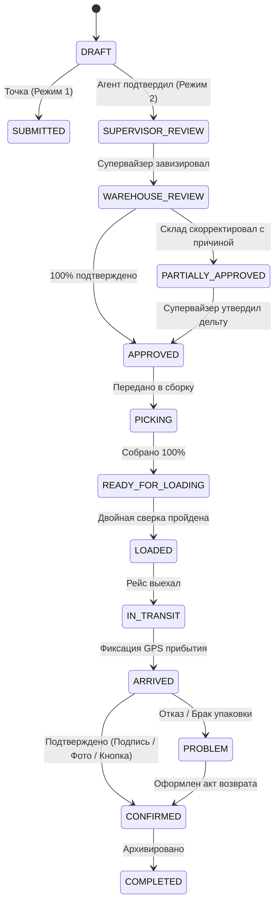

# FUNCTIONAL & TECHNICAL DESIGN SPECIFICATION (FTD v1.0)
## BlackTecCom Production & Distribution Management System (MAKARON)
**Статус документа:** OFFICIAL / APPROVED BASELINE  
**Версия:** 1.0.0  
**Дата:** 22.09.2026  
**Проектная директория:** `F:\ANTIGRAVITY\MAKARON`

---

## ОГЛАВЛЕНИЕ СПЕЦИФИКАЦИИ

- **FTD-01** System Foundation & Архитектура
- **FTD-02** Организационная структура и мультифилиальность
- **FTD-03** Пользователи, учетные записи и профили
- **FTD-04** Матрица ролей и прав доступа (RBAC Matrix)
- **FTD-05** Глобальные бизнес-правила платформы
- **FTD-06** Режим №1: Прямое снабжение собственных точек
- **FTD-07** Режим №2: Дистрибуция через агентов и супервайзера
- **FTD-08** Каталог продукции, номенклатура и фасовка
- **FTD-09** Складской учет, остатки и неснижаемый запас (Safety Stock)
- **FTD-10** Управление заявками и машина состояний (State Machine)
- **FTD-11** Складские рабочие, табель смен и сдельная выработка
- **FTD-12** Торговые агенты, полевые продажи и черновики
- **FTD-13** Супервайзеры, визирование и обработка дефицита
- **FTD-14** Таксимоты (водители-экспедиторы) и минимальный доступ
- **FTD-15** Маршрутизация, конструктор рейсов и версионирование
- **FTD-16** Картография, геозоны и фиксация GPS
- **FTD-17** Процесс доставки и три варианта подтверждения приемки
- **FTD-18** Фотофиксация с водяными знаками и сенсорные подписи
- **FTD-19** Централизованный центр уведомлений (Notification Center)
- **FTD-20** Аналитические дашборды и экспорт отчетов (XLSX, CSV, PDF)
- **FTD-21** Спецификация базы данных (Database Schema Specification)
- **FTD-22** Спецификация REST API контрактов
- **FTD-23** Спецификация событий реального времени (WebSocket Events)
- **FTD-24** Архитектура Offline-First и локальное хранилище IndexedDB
- **FTD-25** Протокол двунаправленной синхронизации данных (Sync Protocol)
- **FTD-26** Стратегии разрешения конфликтов синхронизации (Conflict Resolution)
- **FTD-27** Информационная безопасность, шифрование и сессии
- **FTD-28** Неизменяемый аудит транзакций (Audit Trail)
- **FTD-29** Стратегия резервного копирования и аварийного восстановления
- **FTD-30** Стратегия и структура автоматизированного тестирования
- **FTD-31** Критерии приемочного тестирования (Acceptance Criteria Gherkin)
- **FTD-32** Регламент развертывания, окружения и DevOps

---

## FTD-01. System Foundation & Архитектура

### 1.1. Назначение системы
BlackTecCom Production & Distribution Management System (MAKARON) — цифровая корпоративная платформа, автоматизирующая полный транзакционный цикл макаронного производственного объединения:
$$\text{Производство} \to \text{Склад} \to \text{Заявка} \to \text{Согласование} \to \text{Комплектация} \to \text{Сверка погрузки} \to \text{Маршрут} \to \text{Доставка} \to \text{Подтверждение} \to \text{Аналитика}$$

### 1.2. Архитектурные уровни
1. **Client Tier (PWA / Mobile / Desktop):**
   - React 19 + TypeScript + Vite 6 + Tailwind CSS v4.
   - Локальная встроенная БД IndexedDB (библиотека Dexie.js).
   - Модули захвата сенсорных подписей HTML5 Canvas и камеры с метаданными.
2. **Offline-First Synchronization Tier:**
   - Клиентская очередь мутаций (`syncQueue`) с генерацией UUID v4.
   - Детекция сетевого статуса (`navigator.onLine` + периодический heartbeat).
   - Транзакционный протокол пакетной отправки (Push) и получения серверной дельты (Pull).
3. **Application & Business Logic Tier:**
   - Модули расчета веса партии, проверки складских остатков, сдельной оплаты труда, двухсторонней блокирующей сверки погрузки, версионирования маршрутов.
4. **Data Persistence Tier:**
   - Локальное хранилище клиента (IndexedDB, 22 таблицы).
   - Серверная централизованная база данных (PostgreSQL / SQLite с миграциями Prisma).

---

## FTD-02. Организационная структура и мультифилиальность

Платформа поддерживает иерархическую многофилиальную структуру:
$$\text{Холдинг «BlackTecCom»} \longrightarrow \begin{cases} \text{Завод №1 (Душанбе)} \longrightarrow \text{Склад №1} \longrightarrow \begin{cases} \text{Фирменные точки (Режим 1)} \\ \text{Сектор продаж 1 (Режим 2)} \end{cases} \\ \text{Завод №2 (Худжанд)} \longrightarrow \text{Склад №2} \longrightarrow \begin{cases} \text{Фирменные точки (Режим 1)} \\ \text{Сектор продаж 2 (Режим 2)} \end{cases} \end{cases}$$

Каждая сущность (пользователь, заказ, остаток, наряд, рейс) содержит внешний ключ `warehouse_id` и `region_id`. Руководство и Администратор имеют сквозную видимость всей структуры.

---

## FTD-03. Пользователи, учетные записи и профили

### Перечень системных ролей:
1. `ADMIN` — Администратор системы.
2. `POINT` — Фирменная торговая точка предприятия (Режим 1).
3. `AGENT` — Торговый агент полевых продаж (Режим 2).
4. `SUPERVISOR` — Супервайзер дистрибуции сектора (Режим 2).
5. `ZAVSKLAD` (WAREHOUSE_MANAGER) — Начальник склада готовой продукции.
6. `WORKER` — Работник склада / комплектовщик.
7. `TAXSIMOT` — Водитель-экспедитор службы доставки.
8. `DIRECTOR` — Генеральный директор / Руководство предприятия.
9. `AUDITOR` — Ревизор / Независимый аудитор.

Каждая учетная запись содержит: `id (UUID)`, `username`, `full_name`, `phone`, `role`, `region_id`, `warehouse_id`, `point_id`, `avatar_url`, `is_active`, `created_at`.

---

## FTD-04. Матрица ролей и прав доступа (RBAC Matrix)

| Право (Permission) | ADMIN | POINT | AGENT | SUPERVISOR | ZAVSKLAD | WORKER | TAXSIMOT | DIRECTOR | AUDITOR |
|---|:---:|:---:|:---:|:---:|:---:|:---:|:---:|:---:|:---:|
| `orders.create_direct` | ✕ | **✓** | ✕ | ✕ | ✕ | ✕ | ✕ | ✕ | ✕ |
| `orders.create_draft` | ✕ | ✕ | **✓** | ✕ | ✕ | ✕ | ✕ | ✕ | ✕ |
| `orders.submit_supervisor` | ✕ | ✕ | **✓** | ✕ | ✕ | ✕ | ✕ | ✕ | ✕ |
| `orders.review_supervisor` | ✕ | ✕ | ✕ | **✓** | ✕ | ✕ | ✕ | ✕ | ✕ |
| `orders.forward_warehouse` | ✕ | ✕ | ✕ | **✓** | ✕ | ✕ | ✕ | ✕ | ✕ |
| `orders.warehouse_approve` | ✕ | ✕ | ✕ | ✕ | **✓** | ✕ | ✕ | ✕ | ✕ |
| `orders.warehouse_partial` | ✕ | ✕ | ✕ | ✕ | **✓** | ✕ | ✕ | ✕ | ✕ |
| `orders.accept_adjustment` | ✕ | ✕ | ✕ | **✓** | ✕ | ✕ | ✕ | ✕ | ✕ |
| `orders.view_commercial_prices` | **✓** | **✓** | **✓** | **✓** | ✕ | ✕ | **ЗАПРЕЩЕНО** | **✓** | **✓** |
| `picking.view_tasks` | **✓** | ✕ | ✕ | ✕ | **✓** | **✓** | ✕ | ✕ | ✕ |
| `picking.mark_items` | ✕ | ✕ | ✕ | ✕ | **✓** | **✓** | ✕ | ✕ | ✕ |
| `loading.zavsklad_confirm` | ✕ | ✕ | ✕ | ✕ | **✓** | ✕ | ✕ | ✕ | ✕ |
| `loading.driver_confirm` | ✕ | ✕ | ✕ | ✕ | ✕ | ✕ | **✓** | ✕ | ✕ |
| `routes.create_plan` | ✕ | ✕ | ✕ | **✓** | ✕ | ✕ | ✕ | ✕ | ✕ |
| `routes.lock_version` | ✕ | ✕ | ✕ | **✓** | ✕ | ✕ | ✕ | ✕ | ✕ |
| `delivery.navigate` | ✕ | ✕ | ✕ | ✕ | ✕ | ✕ | **✓** | ✕ | ✕ |
| `delivery.confirm_signature` | ✕ | ✕ | ✕ | ✕ | ✕ | ✕ | **✓** | ✕ | ✕ |
| `delivery.confirm_photo` | ✕ | ✕ | ✕ | ✕ | ✕ | ✕ | **✓** | ✕ | ✕ |
| `workers.manage_attendance` | ✕ | ✕ | ✕ | ✕ | **✓** | ✕ | ✕ | ✕ | ✕ |
| `workers.log_volume_kg` | ✕ | ✕ | ✕ | ✕ | **✓** | ✕ | ✕ | ✕ | ✕ |
| `reports.view_executive` | **✓** | ✕ | ✕ | ✕ | ✕ | ✕ | ✕ | **✓** | **✓** |
| `reports.export_excel` | **✓** | ✕ | ✕ | **✓** | **✓** | ✕ | ✕ | **✓** | **✓** |
| `audit.view_full_history` | **✓** | ✕ | ✕ | ✕ | ✕ | ✕ | ✕ | **✓** | **✓** |

---

## FTD-05. Глобальные бизнес-правила платформы

1. **BR-01 (Неделимость аудита):** Ни одна запись заявки, движения остатков, подтверждения или маршрута не может быть перезаписана с потерей истории. Любая модификация создает версию в `order_versions` / `route_versions` и лог в `audit_logs`.
2. **BR-02 (Запрет отрицательных остатков):** Списание остатков готовой продукции при подтверждении не может переводить доступный баланс в минус без явного распоряжения дирекции.
3. **BR-03 (Двухсторонняя блокирующая сверка погрузки):** Груз не может быть отправлен в рейс, если завсклад и таксимот зафиксировали несовпадающий вес или количество мест.
4. **BR-04 (Изоляция коммерческих данных):** Таксимот видит только грузогабаритные параметры (места, вес, адрес, контакт). Цены, себестоимость и зарплаты скрыты на уровне схемы.

---

## FTD-06. Режим №1: Прямое снабжение собственных точек

Цепочка: `Точка -> Завсклад -> Работники -> Таксимот -> Точка`.
- **Шаг 1.1:** Точка выбирает фасовку (например, 23 кг) и вводит количество упаковок по номенклатуре. Система мгновенно вычисляет суммарный вес ($15+20+10 = 45$ мест, $45 \times 23 = 1035$ кг).
- **Шаг 1.2:** Точка нажимает «Отправить заказ завскладу». Статус: `SUBMITTED`.
- **Шаг 1.3:** Завсклад утверждает 100% (`APPROVED`) либо частично (`PARTIALLY_APPROVED`) с обязательной фиксацией причины дефицита.
- **Шаг 1.4:** Сборка комплектовщиками $\to$ Сверка погрузки $\to$ Рейс $\to$ Электронная приемка точкой (`CONFIRMED`).

---

## FTD-07. Режим №2: Дистрибуция через агентов и супервайзера

Цепочка: `Магазин -> Агент -> Супервайзер -> Завсклад -> Работники -> Таксимот -> Магазин`.
- **Шаг 2.1 (Защита от несогласованных данных):** Агент создает заявку в статусе `DRAFT`. Заявка сохраняется локально.
- **Шаг 2.2:** Агент переходит на экран самопроверки спецификации и нажимает «Подтвердить и отправить супервайзеру». Статус: `SUPERVISOR_REVIEW`.
- **Шаг 2.3:** Супервайзер визирует заказ и передает складу: `WAREHOUSE_REVIEW`.
- **Шаг 2.4 (Цепочка корректировок):** Склад подтверждает 60 шт. из 100 шт. (причина: Дефицит остатка). Супервайзер видит дельту $-40$ шт. и акцептует предложение.
- **Шаг 2.5:** Агент получает push-уведомление с причиной корректировки. Заказ переходит в статус `APPROVED` и поступает в конструктор маршрутов.

---

## FTD-08. Каталог продукции, номенклатура и фасовка

- **Иерархия:** Категория (Макаронные изделия высшего сорта) $\to$ Товар (Вермишель, Макароны классические, Лапша домашняя, Рожки рифленые, Спагетти) $\to$ Фасовка (5 кг, 10 кг, 15 кг, 23 кг, 25 кг, 50 кг) $\to$ Единица учета (мешок, пачка, коробка).
- Авторасчет веса:
  $$\text{Совокупный вес (кг)} = \sum_{i=1}^{n} (\text{Количество}_i \times \text{Вес фасовки}_i)$$

---

## FTD-09. Складской учет, остатки и неснижаемый запас (Safety Stock)

- Складская модель хранит: `quantity_physical` (физический остаток), `quantity_reserved` (зарезервировано под сборку), `min_critical_level` (страховой порог).
- Доступный остаток: $\text{Available} = \text{Physical} - \text{Reserved}$.
- При $\text{Available} \le \text{min_critical_level}$ система выводит критический алерт в интерфейсах завсклада и директора: *«Внимание: складской запас приближается к критическому уровню!»*

---

## FTD-10. Управление заявками и машина состояний (State Machine)

Официальный граф состояний заявки:



---

## FTD-11. Складские рабочие, табель смен и сдельная выработка

- **Табель явки:** Ежедневная фиксация статуса: `PRESENT` (Явка), `SICK` (Больничный), `VACATION` (Отпуск), `DAY_OFF` (Выходной), `ABSENT` (Прогул).
- **Сдельная выработка:** Завсклад фиксирует объем комплектации и погрузки в кг.
- **Расчет сдельной оплаты:**
  $$\text{Сумма к начислению (сом)} = \text{Объем (кг)} \times \text{Тарифная ставка (0.15 сом/кг)}$$

---

## FTD-12. Торговые агенты, полевые продажи и черновики

- Интерактивная карта территории с 4 цветовыми маркерами: 🟢 Активный магазин, 🟡 Черновик, ⚪ Без заявки, 🔴 Проблема.
- Регистрация магазина непосредственно в поле: геопозиция GPS, фото вывески, контакты владельца.
- Полная автономность в офлайн-режиме (накопление в `syncQueue`).

---

## FTD-13. Супервайзеры, визирование и обработка дефицита

- Монитор входящих заказов от всех агентов сектора.
- Инструмент сопоставления «Запрос агента vs Предложение склада» с обязательным указанием дельты.
- Конструктор маршрутов доставки с распределением по автомобилям и таксимотам.

---

## FTD-14. Таксимоты (водители-экспедиторы) и минимальный доступ

- Изолированный интерфейс с крупными элементами для управления одной рукой.
- Строго скрыты коммерческие цены и начисления зарплат.
- Экран пошаговой навигации: «Начать рейс» $\to$ «Прибыл на точку» $\to$ «Подтверждение приемки» $\to$ «Следующая точка».
- Кнопка фиксации отклонений от маршрута с указанием причины (пробка, ремонт, авария).

---

## FTD-15. Маршрутизация, конструктор рейсов и версионирование

- Формирование рейса: выбор автомобиля, водителя и последовательности остановок.
- Изменение порядка остановок (Up/Down) с автопересчетом нити маршрута.
- **Фиксация маршрута:** После утверждения маршрут блокируется (**Версия 1**). При добавлении точек после старта автоматически формируется **Версия 2** с обязательным комментарием причины.

---

## FTD-16. Картография, геозоны и фиксация GPS

- Картографический движок: Leaflet + OpenStreetMap.
- Фиксация GPS-координат:
  - При регистрации новой торговой точки;
  - При отметке «Прибыл на точку»;
  - При сохранении электронной подписи;
  - В виде водяного знака на фотографиях разгрузки.

---

## FTD-17. Процесс доставки и три варианта подтверждения приемки

1. **Вариант 1 (Электронная кнопка точки):** Авторизованный вход сотрудника точки и нажатие кнопки «Подтвердить получение».
2. **Вариант 2 (Сенсорная графическая подпись):** Векторная подпись пальцем/стилусом на экране смартфона водителя (Canvas).
3. **Вариант 3 (Фотоотчет разгрузки):** Снимок продукции у магазина с автоматическим водяным знаком номера накладной, времени и GPS.

---

## FTD-18. Фотофиксация с водяными знаками и сенсорные подписи

- Модуль `CameraPhotoModal.tsx`: автоматически наносит плашку с номером накладной, наименованием магазина, датой/временем с точностью до секунды и GPS-координатами.
- Модуль `SignaturePad.tsx`: сохраняет вектор подписи, ФИО приемщика и дату.

---

## FTD-19. Централизованный центр уведомлений (Notification Center)

- Ролевая маршрутизация нотификаций: Агенту (урезание остатков), Супервайзеру (новые заказы, отклонения маршрута), Завскладу (новые заявки, наряды), Таксимоту (новый рейс, изменение маршрута).
- Хранение статуса прочтения и временных меток.

---

## FTD-20. Аналитические дашборды и экспорт отчетов

- Ситуационный центр директора в реальном времени: объем производства, остатки склада готовой продукции, баланс рейсов, явка смены.
- **Сквозной Цифровой Паспорт Поставки:** Таймлайн любого заказа от клика создания до подписи приемщика.
- Экспорт реестров в Microsoft Excel (`.xlsx`) и CSV.

---

## FTD-21. Спецификация базы данных (22 таблицы Dexie)

Полный перечень объектных хранилищ базы `BlackTecComMakaronDB`:
1. `users`, 2. `warehouses`, 3. `companyPoints`, 4. `shops`, 5. `productCategories`, 6. `products`, 7. `productPackages`, 8. `stock`, 9. `stockMovements`, 10. `orders`, 11. `pickingTasks`, 12. `workers`, 13. `workerAttendance`, 14. `workerWorkLogs`, 15. `workerTariffs`, 16. `loadingOperations`, 17. `vehicles`, 18. `routes`, 19. `deliveries`, 20. `returns`, 21. `auditLogs`, 22. `syncQueue`, 23. `notifications`.

---

## FTD-22. Спецификация REST API контрактов

- `POST /api/v1/auth/login` — вход по логину и паролю, получение JWT.
- `GET /api/v1/orders` — получение списка заказов с фильтрацией по роли.
- `POST /api/v1/orders` — создание заказа (Режим 1 или Режим 2).
- `POST /api/v1/orders/:id/warehouse-approve` — 100% подтверждение завсклада.
- `POST /api/v1/orders/:id/warehouse-adjust` — частичное подтверждение с причиной.
- `POST /api/v1/orders/:id/supervisor-accept` — акцепт супервайзером дельты.
- `POST /api/v1/loading/confirm-zavsklad` — подтверждение передачи груза складом.
- `POST /api/v1/loading/confirm-driver` — подтверждение приема груза водителем.
- `POST /api/v1/deliveries/confirm` — фиксация приемки с подписью/фото.
- `POST /api/v1/sync/push` — пакетная передача очереди офлайн-мутаций.
- `GET /api/v1/sync/pull` — получение инкрементальных дельт сервера.

---

## FTD-23. Спецификация событий реального времени (WebSocket Events)

События WebSocket-шины:
- `order.submitted` $\to$ подписчики: `ZAVSKLAD` (Режим 1) или `SUPERVISOR` (Режим 2).
- `order.adjusted` $\to$ подписчики: `SUPERVISOR`, `AGENT`.
- `loading.discrepancy` $\to$ подписчики: `ZAVSKLAD`, `TAXSIMOT`, `SUPERVISOR`.
- `delivery.confirmed` $\to$ подписчики: `SUPERVISOR`, `DIRECTOR`.

---

## FTD-24. Архитектура Offline-First и локальное хранилище IndexedDB

- Клиентское приложение сохраняет 100% функциональности при `navigator.onLine === false`.
- Справочники магазинов, продукции и фасовок кэшируются в IndexedDB.
- Все локальные мутации получают клиентский UUID v4 и записываются в таблицу `syncQueue`.

---

## FTD-25. Протокол двунаправленной синхронизации данных (Sync Protocol)

При переходе `Offline -> Online`:
1. Извлечение записей из `syncQueue` со статусом `QUEUED`.
2. Перевод в статус `SYNCING`.
3. Пакетная передача на сервер с проверкой `idempotency_key`.
4. Получение подтвержденных идентификаторов $\to$ статус `SYNCED`.
5. Запрос дельты изменений сервера с меткой `last_sync_timestamp`.

---

## FTD-26. Стратегии разрешения конфликтов синхронизации (Conflict Resolution)

- Для заказов (`orders`): если заказ изменен онлайн супервайзером, а агент изменил его офлайн — статус `CONFLICT`. Сервер сохраняет обе версии, а супервайзеру выводится окно сопоставления различий.
- Для остатков (`stock`): строгое серверное транзакционное списание по принципу FIFO.
- Для доставок (`deliveries`): операция идемпотентна, повторная доставка блокируется.

---

## FTD-27. Информационная безопасность, шифрование и сессии

- Хранение паролей в хэшированном виде (Argon2id / bcrypt).
- JWT токены: Access Token (время жизни 15 минут) + HttpOnly Refresh Token (время жизни 7 дней).
- Защита от подделки запросов (CSRF), заголовки Content Security Policy (CSP).
- Rate Limiting: не более 60 запросов в минуту на эндпоинты авторизации.

---

## FTD-28. Неизменяемый аудит транзакций (Audit Trail)

Каждая транзакция сохраняет: `actor_id`, `actor_role`, `action_type`, `entity_name`, `entity_id`, `old_values_json`, `new_values_json`, `diff_summary`, `reason`, `ip_address`, `device_info`, `geo_lat`, `geo_lng`, `timestamp`.  
Таблица `audit_logs` защищена от операций `UPDATE` и `DELETE` на уровне прав СУБД.

---

## FTD-29. Стратегия резервного копирования и аварийного восстановления

- Ежедневный инкрементальный бэкап в 03:00 UTC.
- Еженедельный полный дамп с проверкой целостности (`pg_dump` / snapshot).
- Хранение бэкапов на независимом носителе диска F: и облачном S3-хранилище.
- RPO (Recovery Point Objective): $\le 1$ час; RTO (Recovery Time Objective): $\le 15$ минут.

---

## FTD-30. Стратегия и структура автоматизированного тестирования

- **Unit-тесты:** алгоритмы авторасчета веса партии, расчета сдельной оплаты рабочих ($\text{кг} \times 0.15$), валидация переходов машины состояний.
- **Integration-тесты:** протокол блокирующей сверки погрузки (проверка блокировки при $500 \ne 480$), сериализация очереди `syncQueue`.
- **E2E-тесты:** сквозной проход заявки от Точки через Завсклада до Таксимота и подтверждения подписью.

---

## FTD-31. Критерии приемочного тестирования (Acceptance Criteria Gherkin)

```gherkin
Сценарий: Блокировка погрузки при расхождении веса
  ДОПУСТИМ завсклад передает партию весом 500 кг
  КОГДА таксимот фиксирует фактически принятый вес 480 кг
  ТОГДА система устанавливает статус "LOCKED_DISCREPANCY"
  И кнопка "Начать маршрут" блокируется
  И завсклад и супервайзер получают предупреждающее уведомление
  И выезд автомобиля запрещен до оформления акта устранения расхождения
```

---

## FTD-32. Регламент развертывания, окружения и DevOps

- Установка исключительно на диск **F:** (`F:\tools\nodejs`, `F:\ANTIGRAVITY\MAKARON`).
- Порты: Frontend SPA — 3000, Backend API — 3001, WebSockets — 3001 (`/ws/v1`).
- Production build: `npm run build` формирует оптимизированный бандл в папку `dist/`.

---

## FTD-33. Операционный контур Кассы (Cash Operations)

### 33.1. Структура операционного учета денежных средств
Касса предназначена для строгого операционного учета движения наличных и безналичных средств без перегрузки бухгалтерским планом счетов:
$$ClosingBalance = OpeningBalance + \sum Income - \sum Expense$$

### 33.2. Категории кассовых ордеров:
1. **Приход (`INCOME`):**
   - Инкассация выручки собственных фирменных точек (Режим 1).
   - Прием наличной выручки от торговых агентов по накладным магазинов (Режим 2).
   - Прямой безналичный/наличный расчет оптовых покупателей.
2. **Расход (`EXPENSE`):**
   - Выплата сдельной заработной платы производственным и складским рабочим по закрытым сменам.
   - Компенсация ГСМ и путевых расходов водителям-экспедиторам.
   - Текущие хозяйственные расходы производственных цехов и складов.

### 33.3. Бизнес-ограничения кассы:
- **Запрет отрицательного баланса:** Проведение расходного ордера при $Amount > CurrentBalance$ блокируется с ошибкой `INSUFFICIENT_FUNDS`.
- **Историческая неизменяемость:** Редактирование или удаление ранее проведенных ордеров запрещено. Корректировка возможна только сторнирующей транзакцией с обязательным комментарием и записью в `audit_logs`.

---

## FTD-34. Производственные смены и автоматическое оприходование

### 34.1. Сменная организация выпуска
Каждая партия готовой продукции связывается со сменным графиком:
- `SHIFT_1` (Дневная смена: 08:00 – 20:00).
- `SHIFT_2` (Ночная смена: 20:00 – 08:00).
- Параметрическая привязка к производственной линии (`line_id`).

### 34.2. Формула выработки и автоматическое складское поступление:
$$TotalWeightKg = Quantity \times PackageWeightKg$$
При переводе производственной операции в статус `COMPLETED`:
1. Система автоматически генерирует проводку складского регистра:
   `StockMovement.type = 'PRODUCTION_RECEIPT'`, `deltaQuantity = +Quantity`.
2. Физический остаток склада мгновенно увеличивается:
   $$Physical_{new} = Physical_{old} + Quantity$$
   $$Available_{new} = Physical_{new} - Reserved$$
3. В модуле Директора и Завсклада обновляется показатель суточного выпуска.

---

## FTD-35. Версионируемые тарифы и табель смен

### 35.1. Принцип независимости исторических начислений
Тарифные ставки вынесены в версионируемую сущность `rates` с полями `effective_from` и `effective_to`.
При начислении сдельной оплаты за выработку в запись `work_logs` сохраняется:
- Идентификатор конкретной версии тарифа (`rate_version_id`).
- Фактическая ставка на момент начисления (`applied_rate_per_kg`).
- Изменение действующих тарифов в будущем гарантированно **не изменяет** исторические начисления за прошлые периоды.

### 35.2. Табель рабочего времени (`attendance`)
- Обязательная фиксация статуса присутствия рабочего на смене: `PRESENT`, `SICK`, `VACATION`, `OFF`, `ABSENT`.
- Сдельная оплата может начисляться только при статусе `PRESENT`.

---

## FTD-36. Сквозная прослеживаемость данных (Traceability)

Система обеспечивает сквозной переход по цепочке:
$$\text{KPI Директора} \longrightarrow \text{Сводный отчет} \longrightarrow \text{Первичный расчет} \longrightarrow \text{Запись БД} \longrightarrow \text{Технологическая операция} \longrightarrow \text{Сотрудник/Исполнитель}$$

Любой показатель выработки или финансовый показатель на дашборде раскладывается в один клик до конкретных дат, смен, весов, тарифов и авторов операции.

