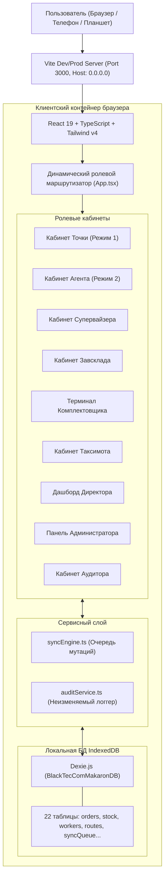

# CURRENT SYSTEM ARCHITECTURE
## BlackTecCom Production & Distribution Management System (MAKARON)
**Документ:** Архитектурное описание текущего состояния  
**Версия:** 1.0.0  
**Дата:** 22.09.2026

---

## 1. Топология текущей реализации

На текущем этапе система развернута как высокопроизводительное **Offline-First Progressive Web Application (PWA)**:



---

## 2. Иерархия компонентов и структура каталогов

```text
F:\ANTIGRAVITY\MAKARON\
├── docs/
│   ├── FTD/                      # Официальные нормативные документы FTD v1.0
│   ├── audit/                    # Отчеты аудита текущего состояния и анализ пробелов
│   ├── architecture/             # Архитектурная документация
│   ├── database/                 # Спецификация схемы БД
│   ├── api/                      # Спецификация REST API и WebSocket
│   └── offline/                  # Спецификация Offline-First протокола
├── src/
│   ├── components/               # Переиспользуемые UI компоненты
│   │   ├── Header.tsx            # Шапка с селектором ролей и индикатором сети
│   │   ├── InteractiveMap.tsx    # Интерактивная карта Leaflet (точки, полилинии)
│   │   ├── SignaturePad.tsx      # Сенсорное полотно Canvas для цифровой подписи
│   │   └── CameraPhotoModal.tsx  # Фотофиксация с водяными знаками (GPS, время)
│   ├── db/
│   │   └── database.ts           # Схема Dexie (22 таблицы) и начальный сидинг
│   ├── services/
│   │   ├── syncEngine.ts         # Движок автономности и очереди мутаций
│   │   └── auditService.ts       # Сервис сквозного аудита (Audit Trail)
│   ├── types/
│   │   └── index.ts              # Строгие TypeScript типы данных всех сущностей
│   ├── views/                    # Ролевые кабинеты системы
│   │   ├── AdminView.tsx         # Панель администратора
│   │   ├── AgentView.tsx         # Мобильный кабинет торгового агента
│   │   ├── AuditorView.tsx       # Кабинет ревизора / аудитора
│   │   ├── DirectorView.tsx      # Ситуационный центр генерального директора
│   │   ├── PointView.tsx         # Кабинет собственной торговой точки
│   │   ├── SupervisorView.tsx    # Кабинет супервайзера и конструктор маршрутов
│   │   ├── TaxsimotView.tsx      # Мобильный кабинет водителя-экспедитора
│   │   ├── WorkerView.tsx        # Сенсорный терминал комплектовщика
│   │   └── ZavskladView.tsx      # Кабинет начальника склада готовой продукции
│   ├── App.tsx                   # Корневой контейнер и ролевая маршрутизация
│   ├── main.tsx                  # Входная точка приложения
│   └── index.css                 # Стили Tailwind CSS v4 и Leaflet
├── package.json                  # Зависимости и скрипты
├── tsconfig.json                 # Конфигурация TypeScript
└── vite.config.ts                # Конфигурация сборщика Vite 6
```

---

## 3. Модель потоков данных (Data Flow)

1. **Создание транзакции (Заказ / Подпись / Отметка / Смена):**
   - Пользователь инициирует действие в UI;
   - Данные валидируются валидаторами интерфейса;
   - Генерируется клиентский UUID v4;
   - Запись сохраняется в локальное хранилище Dexie.js (Optimistic UI);
   - Параллельно формируется запись в `db.auditLogs` с фиксацией автора, времени, дельты и IP/устройства;
   - Мутация помещается в очередь `db.syncQueue` со статусом `QUEUED` (или `SYNCED` при наличии сети).
2. **Сквозная цепочка согласования (End-to-End State Machine):**
   - Каждое изменение статуса сопровождается добавлением записи в массив `order.history` с неизменяемым снимком состояния.
   - Никакие исторические значения не стираются из памяти.
