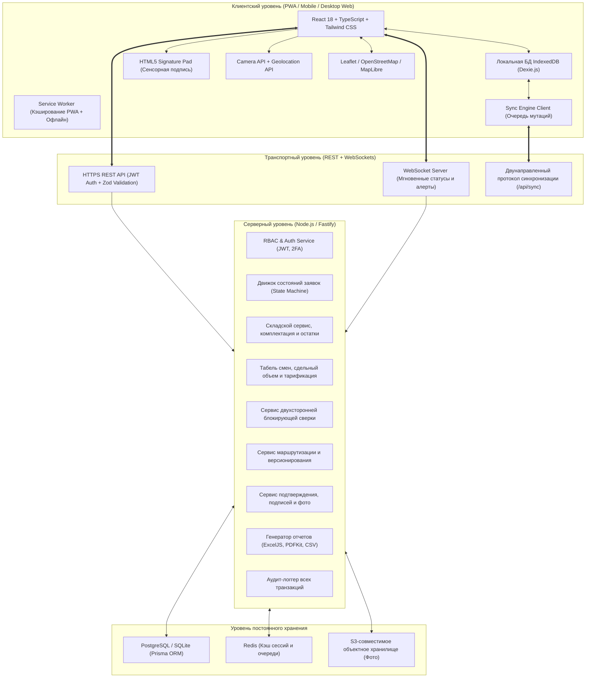
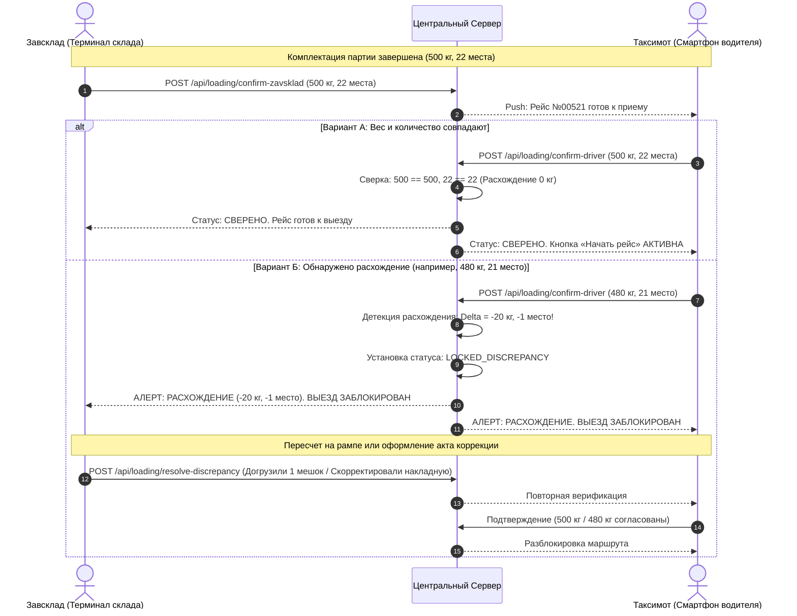

# ЕДИНЫЙ ГЕНЕРАЛЬНЫЙ БИЗНЕС-ПЛАН И ТЕХНИЧЕСКАЯ СПЕЦИФИКАЦИЯ
## Единая цифровая система управления производством, складом, заявками, распределением и доставкой
### Рабочее название: BlackTecCom Production & Distribution Management System (MAKARON)

---

# ЧАСТЬ I. ИСХОДНЫЙ БИЗНЕС-ПЛАН ПРЕДПРИЯТИЯ (РАЗДЕЛЫ 1–75)

Система предназначена для комплексной автоматизации деятельности производственного предприятия макаронных изделий, его центральных и региональных складов, собственных фирменных торговых точек, внешних розничных магазинов, торговых агентов, супервайзеров, производственных и складских рабочих, а также логистической службы распределения и доставки (таксимотов).

Система работает:
- через современные веб-браузеры;
- на настольных компьютерах и ноутбуках (Desktop Web);
- на планшетах (руководители, склад, терминалы);
- на мобильных устройствах Android и iOS (PWA / Мобильные приложения);
- в адаптивном сенсорном интерфейсе, оптимизированном под управление одной рукой;
- в условиях нестабильного интернета или его полного отсутствия;
- в полноценном автономном режиме **Offline-First** с автоматической синхронизацией при появлении сети.

---

### 1. ЦЕЛЬ ПРОЕКТА

Главная цель системы заключается в создании единой цифровой платформы, которая позволит контролировать полный жизненный цикл продукта:

$$\text{Производство} \longrightarrow \text{Склад} \longrightarrow \text{Заявка} \longrightarrow \text{Согласование} \longrightarrow \text{Комплектация} \longrightarrow \text{Загрузка} \longrightarrow \text{Распределение} \longrightarrow \text{Маршрут} \longrightarrow \text{Доставка} \longrightarrow \text{Подтверждение} \longrightarrow \text{Отчётность}$$

При этом система должна полностью исключить или максимально сократить:
- бумажные заявки и накладные;
- телефонные несогласованные заказы;
- потерю заявок в цепочке передачи;
- двойной ввод информации вручную;
- ошибки при комплектации и сборке заказов;
- ошибки при передаче товара на рампе погрузки;
- отсутствие подтверждения фактического получения товара магазином;
- невозможность установить, кто и когда изменил количество в заявке;
- отсутствие истории корректировок и причин урезания заказов;
- путаницу с очередностью и логистикой маршрутов;
- отсутствие контроля явки и производительности рабочих;
- ошибки при расчёте сдельного объёма выполненной работы;
- отсутствие оперативной информации об остатках и дефиците;
- отсутствие консолидированной сквозной статистики для руководства.

---

### 2. ОСНОВНЫЕ РЕЖИМЫ РАБОТЫ

Система поддерживает два ключевых бизнес-режима.

#### Режим №1. Прямое снабжение собственных точек
- **Участники:**
  1. Точка предприятия (Собственный магазин/павильон)
  2. Завсклад (Начальник склада)
  3. Работники склада (Комплектовщики)
  4. Таксимот (Водитель-экспедитор)
  5. Администратор
- **Схема:**
  $$\text{Точка} \longrightarrow \text{Завсклад} \longrightarrow \text{Работники} \longrightarrow \text{Таксимот} \longrightarrow \text{Точка}$$
- Супервайзер и торговый агент в этом режиме не участвуют. Заявка направляется напрямую на склад.

#### Режим №2. Работа через агентов и супервайзера
- **Участники:**
  1. Внешний розничный магазин
  2. Торговый агент
  3. Супервайзер
  4. Завсклад
  5. Работники склада
  6. Таксимот
  7. Администратор
- **Схема:**
  $$\text{Магазин} \longrightarrow \text{Агент} \longrightarrow \text{Супервайзер} \longrightarrow \text{Завсклад} \longrightarrow \text{Работники} \longrightarrow \text{Таксимот} \longrightarrow \text{Магазин}$$
- Это отдельный многоступенчатый бизнес-процесс с согласованием, фильтрацией черновиков и визированием корректировок.

---

### 3. РОЛИ СИСТЕМЫ

#### 3.1. Администратор
Администратор является владельцем информационной системы.
Он управляет:
- пользователями и учетными записями;
- ролями и матрицей прав доступа;
- сотрудниками;
- торговыми точками сети и внешними магазинами;
- торговыми агентами и супервайзерами;
- складами и производственными линиями;
- работниками складов;
- категориями продукции, номенклатурой и фасовками;
- единицами измерения;
- логистическими маршрутами и зонами;
- системными настройками, справочниками и тарифами;
- полным журналом аудита действий;
- аналитической отчётностью.

Администратор не занимается ежедневным оперативным выполнением каждой заявки — его задача заключается в конфигурировании, администрировании и аудите платформы.

**Анкета создания пользователя:**
- ФИО;
- Контактный телефон;
- Логин и пароль (с хэшированием);
- Роль в системе;
- Закрепленный регион/филиал;
- Подразделение/склад;
- Фотография профиля;
- Статус (Активен / Заблокирован);
- Дата создания и история входов.

**Базовые роли системы:**
1. Администратор
2. Завсклад
3. Работник (Комплектовщик)
4. Торговый агент
5. Супервайзер
6. Таксимот (Водитель-экспедитор)
7. Точка (Собственная торговая точка)
8. Руководитель / Генеральный директор
9. Аудитор / Ревизор

---

### 4. РОЛЬ «ТОЧКА»

Точка представляет собственный магазин или фирменную торговую точку предприятия.
У каждой точки имеется собственный защищенный кабинет.

В кабинете точки:
- карточка профиля точки;
- физический адрес и ориентиры;
- точные географические координаты (GPS) и интерактивная карта;
- контактное ответственное лицо и телефон;
- история всех поданных заявок с фильтрацией;
- форма создания новой оперативной заявки;
- онлайн-статус выполнения текущего заказа;
- история фактических поставок;
- реестр полученной продукции по наименованиям и весу;
- журнал недопоставок и расхождений;
- внутренние комментарии к заказам;
- фотоотчёты разгрузок;
- товарно-транспортные электронные документы;
- центр уведомлений о приближении доставки.

---

### 5. ФОРМИРОВАНИЕ ЗАЯВКИ

Интерфейс формирования заявки спроектирован максимально быстрым, крупным и простым.

**Пример структуры заказа:**
- Выбор весовой категории фасовки: **23 кг**
- Внутри выбранной категории:
  - Вермишель — 15 шт. (мешков)
  - Макароны — 20 шт.
  - Лапша — 10 шт.
  - Рожки — 5 шт.

Система производит автоматический мгновенный расчёт:
- общее количество единиц упаковки ($15 + 20 + 10 + 5 = 50$ шт.);
- совокупный вес партии ($50 \times 23\text{ кг} = 1\,150\text{ кг}$);
- разбивка по категориям и видам изделий.

---

### 6. СТРУКТУРА ПРОДУКЦИИ

Номенклатурный справочник имеет строгую иерархическую структуру:
$$\text{Продукция} \longrightarrow \text{Категория} \longrightarrow \text{Подкатегория} \longrightarrow \text{Товар} \longrightarrow \text{Фасовка} \longrightarrow \text{Единица измерения}$$

**Пример:**
- Категория: Макаронные изделия
  - Подкатегория / Товар: Макароны, Вермишель, Лапша, Рожки, Спагетти
- Градация фасовок (весовые категории):
  - 5 кг
  - 10 кг
  - 15 кг
  - 23 кг
  - 25 кг
  - 50 кг
- Единицы складского и логистического учета:
  - шт. (штука)
  - кг (килограмм)
  - мешок
  - коробка
  - пачка / упаковка
  - паллета

Администратор может самостоятельно через панель управления добавлять новые категории, типы продукции и параметры фасовок.

---

### 7. РЕЖИМ №1: ПРЯМАЯ ЗАЯВКА ТОЧКИ

1. Точка формирует заказ в личном кабинете.
   *Пример: Заявка №000152, Точка: «Магазин №4», Фасовка: 23 кг, Товары: Вермишель 15 шт, Макароны 20 шт, Лапша 10 шт. Общий вес: 1 035 кг.*
2. После нажатия кнопки «Отправить заказ» заявка поступает напрямую на монитор завсклада.
3. Начальный статус заявки: **«Ожидает рассмотрения» (`SUBMITTED`)**.

---

### 8. РАБОТА ЗАВСКЛАДА

В реестре входящих заявок завсклад видит:
- уникальный номер заявки;
- точную дату и время поступления;
- наименование точки / заказчика;
- перечень заказанных позиций;
- количество упаковок по каждой строке;
- общий расчетный вес заказа;
- текущий доступный физический и свободный остаток на складе;
- историю предыдущих заказов данной точки;
- примечания и комментарии заказчика.

**Варианты решений завсклада:**
- **Вариант А. Подтвердить полностью (100%).**
  Статус переходит в: **«Подтверждено полностью» (`APPROVED`)**.
- **Вариант Б. Подтвердить частично.**
  *Пример: Запрошено Вермишель 15 шт., фактически подтверждается 10 шт.*
  Завсклад обязан выбрать или указать причину:
  - *«На складе имеется только 10 шт.»*
  - *«Остаток зарезервирован для другой точки»*
  - *«Недостаточное количество готовой продукции на сушке/упаковке»*
  Статус: **«Подтверждено частично» (`PARTIALLY_APPROVED`)**.
- **Вариант В. Отклонить заявку.**
  Обязательное указание причины отказа. Статус: **«Отклонено» (`REJECTED`)**.

---

### 9. ОБЯЗАТЕЛЬНАЯ ФУНКЦИЯ КОРРЕКТИРОВКИ (AUDIT TRAIL)

Критически важный элемент надежности системы: категорически запрещено просто перезаписывать числовое значение $15 \to 10$ с потерей исходной информации.

Система сохраняет неделимый транзакционный снимок:
- **Запрошено:** 15
- **Подтверждено:** 10
- **Разница (дельта):** -5
- **Причина корректировки:** Недостаток товара на основном складе
- **Кто изменил:** Завсклад (ФИО, User ID)
- **Дата и время:** 22.09.2026, 10:32:15 UTC
- **Устройство / IP:** Терминал склада №1 (IP: 192.168.1.45)

Создается полный, защищенный от модификации журнал аудита (**Audit Trail**).

---

### 10. КОМПЛЕКТАЦИЯ ЗАКАЗА

После утверждения заявки складом она переходит на этап физической комплектации.
Завсклад формирует сборочное задание для складских рабочих.

Рабочие видят на терминале комплектации:
- **Задание на сборку к Заявке №000152**
- Позиции к отбору:
  - Вермишель 23 кг — 10 шт.
  - Макароны 23 кг — 20 шт.
  - Лапша 23 кг — 10 шт.

По мере отбора позиций комплектовщики отмечают прогресс:
- Вермишель — собрано 10/10 ✓
- Макароны — собрано 20/20 ✓
- Лапша — собрано 10/10 ✓

После завершения заказ перемещается в буферную зону рампы со статусом **«Готово к погрузке» (`READY_FOR_LOADING`)**.

---

### 11. РАБОТА ЗАВСКЛАДА С РАБОТНИКАМИ

В кабинете завсклада функционирует выделенный модуль **«Работники»**, который обеспечивает:
- добавление нового работника склада в штат;
- деактивацию / увольнение сотрудника;
- редактирование личных и контактных данных;
- указание должности (комплектовщик, грузчик, карщик);
- фиксацию даты начала трудовой деятельности;
- загрузку фотографии сотрудника;
- установку статуса (Активен / На больничном / В отпуске);
- ежедневную отметку присутствия в электронном табеле;
- назначение сборочных заданий и погрузочных нарядов;
- учет физического объема выполненных работ (кг).

---

### 12. УЧЁТ РАБОТЫ (СДЕЛЬНЫЙ ОБЪЕМ)

Система фиксирует персональную выработку сотрудников за каждую смену.
*Пример журнала за 22.09.2026:*

| Работник | Дата смены | Характер работ | Объем (кг) | Статус выполнения |
|---|---|---|---:|---|
| **Иванов Иван Иванович** | 22.09.2026 | Комплектация и загрузка | 150 кг | Выполнено полностью |
| **Петров Пётр Петрович** | 22.09.2026 | Комплектация и загрузка | 200 кг | Выполнено полностью |
| **Сидоров Алексей Сергеевич** | 22.09.2026 | Комплектация и загрузка | 500 кг | Выполнено полностью |

Данные формируются автоматически на основании закрытых сборочных нарядов и погрузочных ведомостей.

---

### 13. ТАБЕЛЬ ПРИСУТСТВИЯ

Завсклад ежедневно заполняет и контролирует интерактивный табель смены:

**Сегодня на смене:**
- ✓ Иванов Иван Иванович (Явка)
- ✓ Петров Пётр Петрович (Явка)
- ✓ Сидоров Алексей Сергеевич (Явка)

**Отсутствуют:**
- ✕ Каримов Карим Каримович
  *Причина отсутствия:* Больничный лист / Ежегодный отпуск / Оплачиваемый выходной / Невыход без уважительной причины / Другая причина (с текстовым комментарием).

Вся история табелей сохраняется в базе данных для расчета отработанного времени.

---

### 14. РАСЧЁТ ПРОИЗВОДИТЕЛЬНОСТИ И ЗАРАБОТНОЙ ПЛАТЫ

По итогам календарного месяца система автоматически рассчитывает индивидуальные показатели:
- **Иванов И.И.:**
  - Отработано дней: 24
  - Совокупный собранный объем: 3 450 кг
  - Среднесуточная выработка: 143,75 кг/день.
- **Петров П.П.:**
  - Отработано дней: 25
  - Совокупный объем: 4 200 кг
  - Среднесуточная выработка: 168,00 кг/день.

**Модуль тарификации сдельной оплаты:**
Система предоставляет настраиваемый механизм:
$$\text{Объем (кг)} \times \text{Тарифная ставка (руб/сом за кг)} = \text{Расчетная сумма к начислению}$$
Возможность применения дифференцированных тарифов по типам фасовки и надбавок за смену.

---

### 15. ПЕРЕДАЧА ТОВАРА ТАКСИМОТУ

После завершения комплектации завсклад передает партию водителю-экспедитору (таксимоту).
Таксимот получает в мобильном приложении:
- идентификатор загрузки / номер рейса;
- дату и расчетное время выезда;
- маршрутную карту и последовательность точек;
- количество обслуживаемых торговых точек;
- перечень категорий фасовок;
- количество мест (мешков/коробок);
- совокупный вес партии в кузове.

#### Принцип минимально необходимого доступа:
Таксимот видит только логистические данные (Точка №5, 23 кг: 15 шт, 20 шт, 10 шт; суммарный вес 1 035 кг). Водителю **категорически запрещен** доступ к коммерческим оптовым ценам, финансовой марже предприятия, себестоимости производства и зарплатам складского персонала.

---

### 16. ДВУХСТОРОННЯЯ СВЕРКА ПЕРЕД ВЫЕЗДОМ (БЛОКИРУЮЩИЙ ХЭНДШЕЙК)

Перед закрытием ворот автомобиля и отправкой в рейс выполняется обязательный регламент:
1. Завсклад на своем устройстве подтверждает: **«Подтверждаю передачу груза: 500 кг, 22 места»**.
2. Таксимот в своем мобильном приложении подтверждает: **«Подтверждаю прием груза: 500 кг, 22 места»**.
3. **Результат сверки:**
   - Если данные совпадают: формируется статус **«Груз готов к отправке» (`LOADED`)**, маршрут разблокируется для движения.
   - **Если обнаружено расхождение:**
     *Пример: Завсклад передает 500 кг, а Таксимот пересчитал и зафиксировал 480 кг (не хватает одного мешка 20 кг).*
     Система выводит алерт: **«Внимание! Обнаружено расхождение (-20 кг)!»** и **жестко блокирует** закрытие рейса до выяснения причины и устранения ошибки.

---

### 17. ДОСТАВКА И МАРШРУТИЗАЦИЯ

Таксимот получает утвержденную последовательность остановок:
$$\text{Точка 1} \longrightarrow \text{Точка 2} \longrightarrow \text{Точка 3} \longrightarrow \text{Точка 4}$$
На навигационном экране отображаются:
- текущее геоположение автомобиля (GPS);
- следующая целевая точка маршрута;
- расстояние до точки и расчетное время прибытия (ETA);
- оперативный статус доставки по каждой точке.

---

### 18. ТРИ ВАРИАНТА ПОДТВЕРЖДЕНИЯ ПОЛУЧЕНИЯ

Для исключения споров при передаче товара реализовано три взаимодополняющих механизма подтверждения:

1. **Вариант 1. Электронное подтверждение магазином:**
   Уполномоченный сотрудник точки входит в свой кабинет и нажимает «Товар получен полностью». Фиксируются: User ID, дата, время, GPS-координаты и модель устройства.
2. **Вариант 2. Сенсорная электронная графическая подпись:**
   Приемщик магазина расписывается пальцем или стилусом непосредственно на сенсорном экране смартфона водителя в специальном поле Canvas. В базу сохраняются: векторный/растровый слепок подписи, ФИО приемщика, дата, время, координаты и ID смартфона.
3. **Вариант 3. Фотоотчёт доставки:**
   Таксимот делает фотоснимок выгруженной продукции на фоне магазина/рампы. Фотография автоматически получает водяной знак (номер накладной, дата, время, координаты GPS) и неразрывно привязывается к заказу.

---

### 19. РЕЖИМ №2. РАБОТА С АГЕНТАМИ И СУПЕРВАЙЗЕРОМ

В Режиме №2 реализуется развернутая цепочка полевых продаж:
$$\text{Магазин} \longrightarrow \text{Агент} \longrightarrow \text{Супервайзер} \longrightarrow \text{Завсклад} \longrightarrow \text{Работники} \longrightarrow \text{Таксимот} \longrightarrow \text{Магазин}$$

---

### 20. МОБИЛЬНЫЙ КАБИНЕТ ТОРГОВОГО АГЕНТА

Агент работает через специализированное мобильное веб-приложение (PWA) на закрепленной территории.
Функционал агента:
- быстрый поиск магазинов по названию, адресу и коду;
- регистрация новой розничной торговой точки непосредственно на месте;
- создание детальной карточки магазина;
- снятие GPS-координат объекта одной кнопкой;
- фотофиксация фасада и торгового зала;
- указание контактных лиц и телефонов владельца/товароведа;
- указание категории магазина, типа ассортимента и графика работы;
- сбор и оформление заказов на поставку.

---

### 21. ИНТЕРАКТИВНАЯ КАРТА АГЕНТА

На картографическом экране агента отображаются торговые точки со статусной цветовой индикацией:
- 🟢 Зеленый — активный магазин с подтвержденной на сегодня заявкой;
- 🟡 Желтый — магазин с сохраненным черновиком или ожидающий подтверждения;
- ⚪ Серый — магазин без заявок на текущую дату;
- 🔴 Красный — магазин с просроченной заявкой, дебиторской задолженностью или рекламацией.
Клик по маркеру открывает карточку магазина и историю его заказов.

---

### 22. ЗАЩИТА ОТ НЕПОДТВЕРЖДЁННЫХ ДАННЫХ (ЧЕРНОВИКИ)

Для предотвращения случайных кликов и передачи «сырых» заказов действует строгий шлюз:
$$\text{Черновик (DRAFT)} \longrightarrow \text{Самопроверка агентом} \longrightarrow \text{Кнопка «Подтвердить отправку»} \longrightarrow \text{Отправлено супервайзеру (SUBMITTED)}$$
Пока агент не нажал кнопку финального подтверждения, заявка остается локальным черновиком и не видна супервайзеру как официальный заказ.

---

### 23. ЕДИНАЯ ЗАПИСЬ (ПРЕДОТВРАЩЕНИЕ ДУБЛИРОВАНИЯ ДАННЫХ)

При передаче заявки система оперирует **единым сквозным объектом документа** в базе данных, а не создает две несогласованные копии. Агент и супервайзер видят одно и то же состояние заказа в соответствии со своими правами, исключая рассинхронизацию информации.

---

### 24. КАБИНЕТ СУПЕРВАЙЗЕРА

Рабочее место супервайзера оснащено оперативным дашбордом:
- общее количество подшефных магазинов и активных агентов;
- количество поступивших новых заявок;
- заявки, ожидающие визирования;
- подтвержденные и переданные на склад заказы;
- отклоненные заявки с причинами;
- скорректированные заявки;
- пулы заказов, готовые к распределению по маршрутам;
- статус текущих рейсов доставки на линии;
- проблемные инциденты и возвраты.

---

### 25. ИНТЕРАКТИВНАЯ КАРТА СУПЕРВАЙЗЕРА

Центральный элемент кабинета супервайзера — общая геоинформационная карта сектора:
- нанесение всех магазинов с фильтрами по статусам;
- текущие геометки перемещения торговых агентов;
- запланированные и активные маршруты доставки;
- автомобили таксимотов на линии в реальном времени;
- маркеры проблемных точек.
Выбор любого магазина открывает карточку, историю отгрузок, объемы продаж и комментарии.

---

### 26. ОБРАБОТКА ЗАЯВКИ СУПЕРВАЙЗЕРОМ

Агент передает:
- Вермишель 23 кг — 15 шт.
- Макароны 23 кг — 20 шт.
- Лапша 23 кг — 10 шт.
Супервайзер проверяет корректность условий, при необходимости вносит предварительные правки и передает консолидированный заказ завскладу.

---

### 27. РАБОТА ЗАВСКЛАДА ВО ВТОРОМ РЕЖИМЕ

Завсклад анализирует:
- текущие свободные складские остатки;
- уже сформированные резервы под другие заявки;
- суточный производственный график;
- пропускную способность рампы комплектации.
Возможные исходы:
1. **Полное выполнение (100%):** заказ резервируется в полном объеме.
2. **Частичное выполнение:** из 100 запрошенных мест подтверждается 60. Завсклад обязан указать статус: *«Выполнение возможно на 60%. Причина: Недостаток продукции на складе»* и зафиксировать доступное количество.
3. **Невозможно выполнить (Отказ):** заявка отклоняется с обязательным комментарием.

---

### 28. ДВУСТОРОННЯЯ ЦЕПОЧКА КОРРЕКТИРОВОК

$$\text{Агент: 100 шт.} \longrightarrow \text{Супервайзер: 100 шт.} \longrightarrow \text{Завсклад: 60 шт. (Причина: Дефицит)} \longrightarrow \text{Супервайзер}$$

Супервайзер в своем интерфейсе видит сопоставление:
- **Первоначально запрошено:** 100 шт.
- **Возможность склада:** 60 шт.
- **Разница (дефицит):** -40 шт.
Супервайзер принимает решение: **«Принять корректировку склада»** либо **«Отклонить и перенести заказ на следующую смену»**.

---

### 29. ФИНАЛЬНАЯ КОРРЕКТИРОВКА СУПЕРВАЙЗЕРОМ И ОПОВЕЩЕНИЕ АГЕНТА

После утверждения супервайзером скорректированного объема (60 шт.):
- заказ переходит в статус комплектации;
- торговый агент мгновенно получает push-уведомление:
  > *«Заявка по магазину №17 скорректирована супервайзером. Подтверждено: 60 шт. из 100 шт. Причина: недостаток продукции на складе.»*
- В карточке заказа у агента четко отображаются: Запрошено: 100, Утверждено: 60, Недостача: 40.

---

### 30. НЕИЗМЕНЯЕМАЯ ИСТОРИЯ ИЗМЕНЕНИЙ (ХРОНОЛОГИЯ)

Каждая транзакция сохраняется без возможности перезаписи:
- *22.09.2026, 09:10* — Агент Алиев создал заявку: 100 шт.
- *22.09.2026, 09:45* — Супервайзер Бобоев проверил и направил на склад.
- *22.09.2026, 10:20* — Завсклад Каримов скорректировал: $100 \to 60$. Причина: дефицит партии.
- *22.09.2026, 10:35* — Супервайзер Бобоев акцептовал корректировку 60 шт.
- *22.09.2026, 10:40* — Заявка переведена на сборку комплектовщикам.

---

### 31. ФОРМИРОВАНИЕ МАРШРУТА ДОСТАВКИ

После утверждения пула заявок супервайзер формирует логистические маршруты:
- Выбор транспортного средства: *Автомобиль №3 (ГАЗель, госномер 01 234 ABC)*;
- Назначение водителя-таксимота: *Рахимов Р.Р.*;
- Включение торговых точек в рейс:
  - Остановка 1 $\to$ Магазин №17
  - Остановка 2 $\to$ Магазин №23
  - Остановка 3 $\to$ Магазин №8
  - Остановка 4 $\to$ Магазин №41
- **Интерактивное изменение очередности:** супервайзер может перетаскивать маркеры точек на карте (Drag & Drop), система автоматически пересчитывает километраж и оптимальный путь.

---

### 32. ВЕРСИОНИРОВАНИЕ И ФИКСАЦИЯ МАРШРУТА

- После нажатия кнопки «Утвердить рейс» маршрут блокируется (**Версия 1**).
- Водитель получает зафиксированный путевой лист.
- Если супервайзеру требуется добавить точку после выезда машины (например, срочный дозаказ):
  $$\text{Маршрут v1} \longrightarrow \text{Маршрут v2}$$
  Система фиксирует обязательную причину: *«Добавлен магазин №15 по распоряжению дирекции»*, а таксимот получает оповещение об изменении путевого листа.

---

### 33. КАБИНЕТ ТАКСИМОТА (РЕЙСОВЫЙ ЭКРАН)

Главный рабочий экран таксимота:
- **Рейс №00521**
- Транспорт: Автомобиль №3
- План на сегодня: 4 торговые точки
- Общий вес партии: 2 150 кг
- Текущий статус: **«Готов к выезду»**
- Наглядный список остановок и интерактивная карта с проложенной нитью маршрута.

---

### 34. ПОШАГОВАЯ НАВИГАЦИЯ РЕЙСА

1. Таксимот нажимает: **«Начать маршрут»** (фиксируется точное время выезда со склада).
2. На экране крупно подсвечивается текущая точка №1.
3. По прибытии на место таксимот нажимает: **«Прибыл на точку»**.
4. После передачи товара и подтверждения магазином: **«Доставка завершена»**.
5. Интерфейс автоматически переключается на **«Следующая точка маршрута»**.

---

### 35. КОНТРОЛЬ МАРШРУТА И ФИКСАЦИЯ ОТКЛОНЕНИЙ

Система логирует ключевые геометки:
- время старта рейса;
- время прибытия на каждую точку;
- время отбытия;
- фактические GPS-координаты;
- фиксацию завершения рейса.

При существенном отклонении автомобиля от траектории супервайзер видит предупреждающий индикатор. При этом система не является «карательным GPS»: водителю предоставляется возможность указать уважительную причину отклонения:
- Дорога перекрыта / ремонт дорожного полотна;
- Дорожно-транспортное происшествие / затор;
- Техническая неисправность автомобиля;
- Прямое указание супервайзера;
- Иная причина.

---

### 36. ПОДТВЕРЖДЕНИЕ МАГАЗИНА (РЕЖИМ 2)

После прибытия автомобиля магазин получает интерактивный запрос:
**«Вы получили продукцию по накладной №...?»**
Кнопки: **«ДА»** / **«НЕТ»**.
- При выборе **«ДА»**: фиксируются ФИО товароведа, точное время, координаты, электронная подпись на экране или прикрепляется фото.
- При выборе **«НЕТ»**: обязательный ввод причины отказа (закрыто, пересортица, повреждение упаковки, отсутствие денежных средств).

---

### 37. ФОТОКОНТРОЛЬ ОПЕРАЦИЙ

В системе реализованы фотопривязки к операциям:
- Фотография кузова загруженного автомобиля перед выездом;
- Фотография общего вида продукции на рампе;
- Фотография процесса разгрузки у дверей магазина;
- Фотография поврежденной упаковки в случае рекламаций.
Все фотографии привязываются к конкретному ID рейса и накладной с метаданными времени и геолокации.

---

### 38. ЦЕНТРАЛИЗОВАННЫЙ ЦЕНТР УВЕДОМЛЕНИЙ (NOTIFICATION CENTER)

- **Торговому агенту:**
  - Заявка создана / черновик сохранен;
  - Заявка принята супервайзером;
  - Заявка скорректирована складом (с указанием дельты и причины);
  - Заявка отклонена;
  - Заказ передан на комплектацию.
- **Супервайзеру:**
  - Поступила новая заявка от агента;
  - Поступил ответ склада с корректировкой остатков;
  - Загрузка автомобиля завершена;
  - Таксимот подтвердил прием груза на рампе;
  - Зафиксировано отклонение от маршрута;
  - Доставка на точку завершена успешно / зафиксирована проблема.
- **Завскладу:**
  - Поступила новая заявка на визирование;
  - Заявка утверждена в комплектацию;
  - Назначен новый маршрут погрузки;
  - Рейс готов к сверке.
- **Таксимоту:**
  - Назначен новый рейс доставки;
  - Маршрут изменен супервайзером (версия v2);
  - Добавлена новая промежуточная точка;
  - Получено подтверждение приемки от магазина.

---

### 39. РЕЖИМ OFFLINE MODE (АВТОНОМНАЯ РАБОТА)

Один из важнейших системообразующих компонентов платформы. В отдаленных горных районах, подвальных складских помещениях и сельских магазинах доступ к сотовой сети часто отсутствует.

Агент в офлайн-режиме может:
- открыть каталог продукции и карточку магазина из локальной памяти;
- сформировать новый заказ;
- сделать фотографии и сохранить координаты GPS;
- зафиксировать черновик.

Все транзакции сохраняются в локальном защищенном хранилище со статусом **«Ожидает синхронизации» (`QUEUED`)**.
При восстановлении соединения движок синхронизации автоматически отправляет данные на сервер без участия пользователя:
$$\text{Локальная запись} \longrightarrow \text{Синхронизация...} \longrightarrow \text{Успешно отправлено на сервер}$$

---

### 40. АРХИТЕКТУРА OFFLINE-FIRST

Система изначально спроектирована по стандарту **Offline-First**, а не как веб-страница с заглушкой об ошибке сети.
- Клиентское мобильное приложение содержит локальную базу данных (IndexedDB / Dexie.js);
- Каждое действие пользователя получает универсальный уникальный идентификатор (UUID v4) на клиенте;
- Движок синхронизации (Sync Engine) отслеживает статус канала связи и организует транзакционную передачу накопленной очереди:
  $$\text{Local Database (IndexedDB)} \xrightarrow{\quad\text{Sync Engine}\quad} \text{Server Database (PostgreSQL/Prisma)}$$

---

### 41. РАЗРЕШЕНИЕ КОНФЛИКТОВ СИНХРОНИЗАЦИИ (CONFLICT RESOLUTION)

*Сценарий конфликта:* Агент отредактировал заявку офлайн в магазине, а супервайзер одновременно скорректировал её через веб-панель.
Система **не перезаписывает данные «вслепую»**.
1. Детектируется коллизия: **«Conflict detected»**;
2. Сохраняются обе версии: версия агента и серверная версия супервайзера;
3. Фиксируются метки времени, авторы изменений и дифф полей;
4. Применяется детерминированное правило: супервайзеру выводится диалоговое окно сопоставления различий для окончательного подтверждения финальной версии.

---

### 42. СПЕЦИФИКАЦИЯ МОБИЛЬНОЙ ВЕРСИИ

Для агентов и таксимотов мобильный интерфейс является основным рабочим инструментом:
- крупные интерактивные элементы и шрифты высокой контрастности;
- оптимизация геометрии кнопок под нажатие большим пальцем одной руки;
- моментальный вызов встроенной камеры смартфона;
- встроенный сканер QR/штрихкодов;
- мгновенный доступ к навигации и GPS;
- сенсорное полотно для подписи получателя.

---

### 43. СПЕЦИФИКАЦИЯ WEB-ВЕРСИИ (DESKTOP)

Для Администратора, Завсклада, Супервайзера и Руководства основным интерфейсом выступает Desktop Web:
- широкоформатные дашборды мониторинга в реальном времени;
- таблицы с мгновенным поиском, фильтрацией и экспортом;
- интерактивные карты масштаба города/области;
- удобная работа с клавиатурой и горячими клавишами.

---

### 44. ЕДИНАЯ СИСТЕМА АВТОРИЗАЦИИ

- Аутентификация по связке: Логин + Надежный пароль / ПИН-код;
- Привязка учетной записи к роли и структурному подразделению (филиал, склад, сектор);
- Автоматическая маршрутизация в соответствующее рабочее пространство после логина:
  - Агент $\longrightarrow$ Мобильный кабинет торгового агента;
  - Завсклад $\longrightarrow$ Панель управления складом и комплектацией;
  - Супервайзер $\longrightarrow$ Центр распределения, маршрутов и карты;
  - Таксимот $\longrightarrow$ Мобильный кабинет рейсов и навигации;
  - Точка $\longrightarrow$ Кабинет заказов собственной сети;
  - Директор $\longrightarrow$ Аналитический ситуационный центр.

---

### 45. РОЛЕВАЯ МОДЕЛЬ ДОСТУПА (RBAC)

Строгое разграничение видимости данных:
Таксимоту категорически недоступны:
- оптовые и розничные цены, выручка, финансовые отчеты;
- начисленная заработная плата складских рабочих;
- складские запасы других категорий и подразделений;
- чужие рейсы и маршрутные листы;
- персональные данные клиентов, не связанные с адресом доставки.

---

### 46. АУДИТ И ЖУРНАЛИРОВАНИЕ ДЕЙСТВИЙ (AUDIT LOGS)

Каждая транзакция в системе протоколируется:
- **Субъект:** Пользователь Иванов Иван (ID: 42, Роль: Завсклад);
- **Действие:** Корректировка количества позиции «Вермишель 23 кг»;
- **Было:** 100 шт.;
- **Стало:** 60 шт.;
- **Дельта:** -40 шт.;
- **Обоснование:** Недостаток товара на основном складе;
- **Время:** 22.09.2026, 10:32:41 UTC;
- **Источник:** Мобильный терминал склада Zebra TC26;
- **Геолокация:** Координаты 38.5358° N, 68.7790° E.

---

### 47. СВОДНЫЙ ДАШБОРД РУКОВОДИТЕЛЯ (СИТУАЦИОННЫЙ ЦЕНТР)

Оперативные показатели за текущий день в реальном времени:
- **Заявки за сегодня:** 152
- **Успешно выполнено и доставлено:** 137
- **Находятся в процессе (сборка / путь):** 10
- **Проблемные поставки / рекламации:** 5
- **Суммарный объем отгруженной продукции:** 12 850 кг.

---

### 48. АНАЛИТИКА ПРОИЗВОДСТВА

Сквозной баланс движения готовой продукции:
$$\text{Произведено} \longrightarrow \text{Собрано} \longrightarrow \text{Загружено} \longrightarrow \text{Отправлено} \longrightarrow \text{Доставлено} \longrightarrow \text{Возвращено} \longrightarrow \text{Недопоставлено}$$
Оценка процента потерь, брака и расхождений на каждом технологическом переделе.

---

### 49. АНАЛИТИКА СКЛАДСКИХ ЗАПАСОВ

- Текущие физические остатки готовой продукции по складам и фасовкам;
- Динамика прихода с упаковочных линий и расхода в логистику;
- Зарезервированный объем под подтвержденные заявки;
- Расчет дефицита и прогноз потребности сырья/упаковки;
- **Контроль неснижаемого страхового остатка (Safety Stock):**
  *Пример: Макароны 23 кг — Фактический остаток: 500 кг. Установленный минимальный порог: 300 кг. При приближении к 350 кг система выдает предупреждение: «Внимание: складской запас приближается к критическому уровню!»*

---

### 50. АНАЛИТИКА ТОРГОВЫХ АГЕНТОВ

KPI и статистика работы полевых представителей:
- количество новых зарегистрированных торговых точек за период;
- общее число собранных заявок;
- конверсия подтверждения заказов супервайзером и складом;
- количество отклоненных заявок;
- суммарный физический объем продаж в килограммах;
- хронометраж посещения точек и карта фактического покрытия территории.

---

### 51. АНАЛИТИКА СУПЕРВАЙЗЕРОВ

Оценка эффективности управленческого звена:
- скорость обработки и визирования входящих заявок (среднее время в минутах);
- процент и характер вносимых корректировок;
- количество рекламаций и инцидентов на подшефной территории;
- своевременность закрытия рейсов доставки;
- коэффициент утилизации грузоподъемности транспорта.

---

### 52. АНАЛИТИКА ТАКСИМОТОВ (СЛУЖБЫ ДОСТАВКИ)

Логистические показатели водителей:
- количество выполненных рейсов за смену/месяц;
- количество обслуженных торговых точек;
- соблюдение графика и среднее время разгрузки на одной точке;
- количество успешно закрытых накладных без замечаний;
- зафиксированные отклонения от утвержденного маршрута;
- процент возвратов продукции от магазинов.

---

### 53. ОТЧЁТНОСТЬ ПО СКЛАДСКИМ РАБОТНИКАМ

Карточка производительности каждого рабочего:
- ФИО и табельный номер;
- количество отработанных смен по табелю;
- количество дней отсутствия с классификацией причин;
- суммарный собранный объем продукции (кг);
- количество закрытых сборочных нарядов;
- средняя суточная выработка;
- сводный зарплатный показатель: $\text{Объем (кг)} \times \text{Тариф} = \text{К начислению}$.

---

### 54. РЕЕСТР И ФОРМАТЫ ЭКСПОРТА ОТЧЕТОВ

Система поддерживает выгрузку данных в форматы **Microsoft Excel (XLSX)**, **CSV** и **Adobe PDF**:
1. Сводный реестр заявок с историей статусов;
2. Отчет по выпуску готовой продукции;
3. Оборотно-сальдовая ведомость склада;
4. Справка о текущих остатках и дефиците;
5. Отчет о движении товаров (приход, расход, списание, возврат);
6. Журнал путевых листов и доставок;
7. Анализ эффективности логистических маршрутов;
8. Реестр торговых точек и магазинов;
9. Ведомость выработки торговых агентов;
10. Аналитический отчет по супервайзерам;
11. Логистический отчет по таксимотам;
12. Табель учета рабочего времени складского персонала;
13. Ведомость сдельной выработки и расчетных начислений рабочих;
14. Фотоархив подтверждений доставок;
15. Ведомость недопоставок и расхождений;
16. Журнал актов возврата продукции;
17. Журнал корректировок заказов (Audit Trail).

---

### 55. ПОЛНЫЙ ЖИЗНЕННЫЙ ЦИКЛ СТАТУСОВ ЗАЯВКИ

```text
DRAFT (Черновик)
   │
   ▼
SUBMITTED (Отправлена заказчиком / агентом)
   │
   ▼
SUPERVISOR_REVIEW (Проверка и визирование супервайзером)
   │
   ▼
WAREHOUSE_REVIEW (Проверка наличия и резервирование завскладом)
   │
   ├──────────────────────────────┐
   ▼                              ▼
PARTIALLY_APPROVED             APPROVED
(Частично подтверждена)      (Подтверждена полностью)
   │                              │
   └──────────────┬───────────────┘
                  ▼
          PICKING (Комплектация работниками)
                  │
                  ▼
          READY_FOR_LOADING (Собрана, ожидает на рампе)
                  │
                  ▼
          LOADED (Загружена в автомобиль, сверка пройдена)
                  │
                  ▼
          IN_TRANSIT (Автомобиль в пути по маршруту)
                  │
                  ▼
          ARRIVED (Прибыла к торговой точке)
                  │
                  ▼
          DELIVERED (Выгружена, передана приемщику)
                  │
                  ▼
          CONFIRMED (Получение подтверждено: подпись/фото/код)
                  │
                  ▼
          COMPLETED (Полностью завершена, архивирована)

* При возникновении нештатной ситуации в любой точке процесса: PROBLEM (Проблема)
```

---

### 56. ОБРАБОТКА ПРОБЛЕМ И ИНЦИДЕНТОВ

На каждом этапе выполнения доступна кнопка **«Сообщить о проблеме»**:
Классификатор типовых причин:
- Товар отсутствует на складе в требуемом объеме;
- Фактическое количество мест не совпадает с накладной;
- Магазин закрыт по графику или на переучет;
- Ошибочный или неточный адрес торговой точки;
- Ответственное контактное лицо магазина отсутствует на месте;
- Техническая поломка или авария автомобиля доставки;
- Дорога перекрыта дорожными службами;
- Повреждение целостности упаковки при транспортировке (бой/разрыв);
- Полный отказ магазина от приемки партии;
- Прочая нештатная ситуация.
Обязательные требования: текстовый комментарий с описанием ситуации и фотофиксация дефекта/инцидента.

---

### 57. ОФОРМЛЕНИЕ ВОЗВРАТОВ ПРОДУКЦИИ

В случае частичного или полного непринятия товара магазином:
1. Таксимот в приложении нажимает «Оформить возврат»;
2. Указывает артикул продукции и количество возвращаемых мест/упаковок;
3. Выбирает причину возврата из справочника;
4. Прикрепляет подтверждающую фотографию брака или акта;
5. Система генерирует электронный **Акт возврата продукции**;
6. Товар помечается к возврату на склад, а завсклад при приемке автомобиля оприходует позиции обратно в складские остатки.

---

### 58. СИСТЕМА ИДЕНТИФИКАЦИИ ПО QR-КОДАМ

Перспективная сквозная интеграция двухмерных матричных кодов (QR / DataMatrix):
- QR-код торговой точки (быстрое открытие карточки магазина агентом);
- QR-код заявки / накладной;
- QR-код сводного рейса погрузки;
- QR-код транспортной паллеты / мешка продукции;
- QR-код сборочного наряда для комплектовщика.
Пример: завсклад сканирует QR-код путевого листа с экрана смартфона водителя и мгновенно переходит к акту сверки рейса.

---

### 59. ЮРИДИЧЕСКИ ЗНАЧИМАЯ ЭЛЕКТРОННАЯ ПОДПИСЬ

Применение электронной подписи для разграничения материальной ответственности:
- Передача со склада водителю: электронный акт приема-передачи с фиксацией цифровых подписей Завсклада и Таксимота;
- Передача в магазине: графическая подпись товароведа на сенсорном экране смартфона водителя с криптографическим хэшированием времени и GPS-координат.

---

### 60. ИНФОРМАЦИОННАЯ БЕЗОПАСНОСТЬ

- Работа исключительно по защищенному протоколу HTTPS / WSS;
- Сквозное шифрование конфиденциальных данных;
- Аутентификация на основе стандартов JWT (JSON Web Tokens) с ротацией Refresh-токенов;
- Двухфакторная аутентификация (2FA) для учетных записей администраторов и руководства;
- Неизменяемый журнал аудита действий пользователей (Audit Trail);
- Регистрация и привязка доверенных мобильных устройств (Device Fingerprinting);
- Ограничение частоты запросов к API (Rate Limiting);
- Защита от межсайтового скриптинга (XSS) и подделки запросов (CSRF);
- Автоматизированное резервное копирование и план аварийного восстановления (Disaster Recovery).

---

### 61. СТРАТЕГИЯ РЕЗЕРВНОГО КОПИРОВАНИЯ

- Ежедневное инкрементальное резервное копирование базы данных (`Daily Backup`);
- Еженедельный полный снимок (`Weekly Full Backup`);
- Ежемесячный архивный срез с долгосрочным хранением (`Monthly Archive`);
- Географически распределенное хранение копий минимум в двух независимых дата-центрах / хранилищах.

---

### 62. ТЕХНОЛОГИЧЕСКИЙ СТЕК РАЗРАБОТКИ

- **Пользовательский интерфейс (Frontend):** React / TypeScript / Vite / Tailwind CSS;
- **Мобильный клиент:** Progressive Web Application (PWA) с Service Worker и поддержкой мобильного контейнера Capacitor;
- **Серверная часть (Backend):** Node.js (TypeScript) на базе скоростного фреймворка Fastify или Express / Альтернатива: .NET 8 Web API;
- **База данных (Database):** PostgreSQL / SQLite с доступом через современную ORM Prisma;
- **Оперативное кэширование и очереди:** Redis / Внутрипамятные очереди;
- **Файловое хранилище (Медиа/Фото):** S3-совместимое хранилище (MinIO / Cloud Object Storage);
- **Картография и геоданные:** Leaflet / OpenStreetMap / MapLibre GL;
- **Двунаправленная связь в реальном времени:** WebSockets;
- **Автономное хранилище клиента (Offline):** IndexedDB (библиотека Dexie.js).

---

### 63. СХЕМА ВЗАИМОДЕЙСТВИЯ РОЛЕЙ

```text
                    ┌─────────────────┐
                    │      ADMIN      │
                    └────────┬────────┘
                             │
              ┌──────────────┴──────────────┐
              │                             │
        ┌─────▼─────┐                 ┌─────▼─────┐
        │ SUPERVISOR│                 │ WAREHOUSE │
        └─────┬─────┘                 └─────┬─────┘
              │                             │
        ┌─────▼─────┐                 ┌─────▼─────┐
        │   AGENT   │                 │  WORKERS  │
        └─────┬─────┘                 └─────┬─────┘
              │                             │
        ┌─────▼─────┐                       │
        │   SHOPS   │                       │
        └─────┬─────┘                       │
              │                             │
              └─────────────┬───────────────┘
                            │
                      ┌─────▼─────┐
                      │ TAXSIMOT  │
                      └─────┬─────┘
                            │
                      ┌─────▼─────┐
                      │ DELIVERY  │
                      └───────────┘
```

---

### 64. БАЗОВЫЙ ПЕРЕЧЕНЬ СУЩНОСТЕЙ БАЗЫ ДАННЫХ

Таблицы информационной модели:
1. `users` — учетные записи пользователей системы;
2. `roles` — роли и уровни доступа;
3. `permissions` — атомарные права;
4. `employees` — карточки сотрудников предприятия;
5. `agents` — профили торговых агентов;
6. `supervisors` — профили супервайзеров;
7. `warehouses` — склады и производственные площадки;
8. `workers` — складские рабочие и комплектовщики;
9. `shops` — внешние розничные магазины;
10. `company_points` — фирменные торговые точки собственной сети;
11. `products` — наименования выпускаемой продукции;
12. `product_categories` — категории товаров;
13. `product_packages` — варианты фасовок и упаковок с весом;
14. `stock` — складские физические и резервные остатки;
15. `stock_movements` — журнал движения складских остатков;
16. `orders` — сводный заголовок заявки на поставку;
17. `order_items` — товарные позиции заявки;
18. `order_versions` — аудит-версии и хронология изменений заявки;
19. `order_comments` — внутренние служебные комментарии;
20. `warehouse_confirmations` — подтверждения и обоснования завсклада;
21. `picking_tasks` — задания на сборку заказов;
22. `workers_tasks` — сборочные наряды конкретных рабочих;
23. `loading_operations` — акты погрузки автомобилей;
24. `loading_confirmations` — взаимные подтверждения погрузки;
25. `drivers` / `taxsimots` — профили водителей-экспедиторов;
26. `vehicles` — грузовой автотранспорт;
27. `routes` — маршруты и рейсы доставки;
28. `route_points` — остановки и последовательность точек маршрута;
29. `deliveries` — факты передачи товара на точках;
30. `delivery_confirmations` — электронные акты приемки;
31. `signatures` — графические цифровые подписи получателей;
32. `photos` — фотоархив доставок, загрузок и повреждений;
33. `attendance` — ежедневный табель явки складских рабочих;
34. `work_logs` — журнал сдельной физической выработки рабочих (кг);
35. `returns` — акты возврата продукции;
36. `notifications` — сообщения центра уведомлений;
37. `audit_logs` — системный журнал аудита безопасности;
38. `sync_queue` — локальная очередь мутаций офлайн-режима;
39. `devices` — зарегистрированные доверенные устройства.

---

### 65. МОДЕЛЬ ДАННЫХ OFFLINE-РЕЖИМА

Каждая транзакция, генерируемая мобильным приложением, снабжается метаданными:
- Уникальный идентификатор: **UUID v4** (например, `7f8c12a4-56e1-4b28-98e3-4a6c8b123456`);
- Метки времени: `created_at` (локальное время устройства) и `updated_at`;
- Идентификатор терминала: `device_id`;
- Статус локальной синхронизации: `sync_status`;
- Версионные счетчики: `local_version` и `server_version`.

**Жизненный цикл статуса синхронизации:**
$$\text{LOCAL} \longrightarrow \text{QUEUED} \longrightarrow \text{SYNCING} \longrightarrow \text{SYNCED} \quad\text{или}\quad \text{CONFLICT}$$

---

### 66. РЕГЛАМЕНТ РАБОТЫ ДВИЖКА СИНХРОНИЗАЦИИ

При восстановлении связи алгоритм выполняет:
1. Тестовый пинг сервера (`Healthcheck`);
2. Запрос актуальной версии сервера для активных документов;
3. Пакетную отправку локально накопленных мутаций из `sync_queue`;
4. Получение ответа сервера с фиксацией успешных ID;
5. Выявление и фиксацию конфликтов параллельного изменения;
6. Актуализацию локальной базы IndexedDB новыми данными с сервера;
7. Индикацию пользователю: *«Синхронизировано: 17 операций»* либо *«Ожидают синхронизации: 3»*.

---

### 67. МАСШТАБИРУЕМОСТЬ ПЛАТФОРМЫ

Архитектура системы рассчитана на многократный рост:
- Начальный этап: 20–50 пользователей;
- Этап масштабирования: 500, 1 000, 5 000+ одновременных пользователей;
- Поддержка территориально распределенной сети: несколько производственных комбинатов, сеть региональных распределительных центров, десятки складов и сотни автомобилей доставки.

---

### 68. МУЛЬТИФИЛИАЛЬНОСТЬ И МНОГОЗАВОДСКАЯ СТРУКТУРА

$$\text{Холдинг / Предприятие} \longrightarrow \begin{cases} \text{Завод №1} \longrightarrow \text{Склады готовой продукции} \longrightarrow \text{Регион №1} \\ \text{Завод №2} \longrightarrow \text{Склады готовой продукции} \longrightarrow \text{Регион №2} \end{cases}$$
Каждая транзакция строго привязана к идентификатору филиала/завода с возможностью консолидированной отчетности в головном офисе.

---

### 69. ОПЕРАТИВНЫЙ МОНИТОР РУКОВОДИТЕЛЯ (РЕАЛЬНОЕ ВРЕМЯ)

```text
┌────────────────────────────────────────────────────────┐
│             СИТУАЦИОННЫЙ ЦЕНТР ДИРЕКТОРА               │
├──────────────────────────┬─────────────────────────────┤
│ Производство за смену:   │ Склад готовой продукции:    │
│ 12 500 кг                │ 87 000 кг                   │
├──────────────────────────┼─────────────────────────────┤
│ Всего заявок за сегодня: │ Выполнено и доставлено:     │
│ 152                      │ 121                         │
├──────────────────────────┼─────────────────────────────┤
│ Автомобили в пути:       │ Проблемные инциденты:       │
│ 17                       │ 4                           │
├──────────────────────────┼─────────────────────────────┤
│ Рабочие на смене:        │ Отсутствуют по табелю:      │
│ 34 чел.                  │ 6 чел.                      │
└──────────────────────────┴─────────────────────────────┘
```

---

### 70. СКВОЗНОЙ КОНТРОЛЬ ЦИКЛА («ЦИФРОВОЙ ПАСПОРТ ПОСТАВКИ»)

Руководитель может открыть любую накладную и просмотреть полный неразрывный таймлайн:
$$\text{Кто заказал} \to \text{Кто принял} \to \text{Кто скорректировал} \to \text{Почему урезали} \to \text{Кто собрал} \to \text{Кто загрузил} \to \text{Кто привез} \to \text{Когда вручили} \to \text{Кто расписался} \to \text{Фото}$$
Это цифровой паспорт каждой поставки, гарантирующий персональную ответственность на каждом этапе.

---

### 71. ОЖИДАЕМЫЙ БИЗНЕС-ЭФФЕКТ ОТ ВНЕДРЕНИЯ

1. Полная централизация потока заказов из всех каналов;
2. Жесткий оперативный контроль остатков готовой продукции на складах;
3. Синхронизация производственных планов с реальным спросом;
4. 100% прозрачность работы и персональной выработки складских рабочих;
5. Повышение дисциплины и эффективности работы торговых агентов;
6. Автоматизация работы супервайзеров и исключение человеческого фактора;
7. Оптимизация маршрутов и строгий контроль службы доставки;
8. Полное исключение потери накладных и несанкционированных изменений заказов;
9. Сокращение бумажного документооборота более чем на 90%;
10. Снижение ошибок при комплектации и погрузке продукции до минимума;
11. Рост скорости обработки и доставки заказов в 2–3 раза;
12. Формирование базы достоверных данных для стратегического анализа и развития бизнеса.

---

### 72. СТАДИИ И ЭТАПЫ РЕАЛИЗАЦИИ

1. **Этап 1. Проектирование:** разработка детальной модели данных, проектирование UI/UX экранов всех ролей, фиксация протоколов синхронизации.
2. **Этап 2. Базовое ядро (Core):** подсистема авторизации, RBAC-матрица, справочники номенклатуры, складов, контрагентов.
3. **Этап 3. Подсистема заказов:** создание, многоступенчатое согласование, корректировки с фиксацией дельты, нотификации.
4. **Этап 4. Складской контур:** партионный учет, сборочные наряды, табель и сдельная выработка рабочих, модуль погрузки.
5. **Этап 5. Контур дистрибуции:** мобильный кабинет агента, картография, кабинет супервайзера, конструктор маршрутов.
6. **Этап 6. Логистический контур:** кабинет таксимота, навигация, электронная подпись, фотоконтроль, возвратные накладные.
7. **Этап 7. Автономность (Offline-First):** локальная база IndexedDB, очередь мутаций, протокол синхронизации и коллизий.
8. **Этап 8. Аналитика и отчетность:** дашборды директора, экспорт в Excel/CSV/PDF, сквозной цифровой паспорт.
9. **Этап 9. Защита и масштабирование:** аудит безопасности, 2FA, оптимизация производительности.

---

### 73. ОБЪЕМ МИНИМАЛЬНО ЖИЗНЕСПОСОБНОГО ПРОДУКТА (MVP)

В состав первой релизной версии входят:
- Ролевые кабинеты: Администратор, Завсклад, Точка, Агент, Супервайзер, Таксимот, Работник, Директор;
- Полный сквозной цикл движения заявки (Режимы 1 и 2);
- Журнал корректировок заявок с фиксацией причин (Audit Trail);
- Складской модуль: комплектация, учет остатков, табель и сдельная выработка рабочих;
- Модуль погрузки с двухсторонней блокирующей сверкой Завсклад ↔ Таксимот;
- Маршрутизация на интерактивной карте с пошаговой навигацией;
- Три способа подтверждения доставки (кнопка, сенсорная подпись на экране, фотоотчет);
- Базовый автономный режим Offline-First для полевых сотрудников;
- Оперативный дашборд руководителя и базовые отчеты.

В последующих обновлениях подключаются: сканирование QR-кодов паллет, нейросетевая оптимизация маршрутов и прогнозирование спроса.

---

### 74. КЛЮЧЕВАЯ ОСОБЕННОСТЬ: ЕДИНАЯ ТРАНЗАКЦИОННАЯ СИСТЕМА

Система строится не как набор разрозненных приложений, а как единая неразрывная процессная цепочка:
$$\text{Заявка №...} \longrightarrow \text{Магазин} \longrightarrow \text{Агент} \longrightarrow \text{Супервайзер} \longrightarrow \text{Завсклад} \longrightarrow \text{Сборка} \longrightarrow \text{Работники} \longrightarrow \text{Погрузка} \longrightarrow \text{Таксимот} \longrightarrow \text{Маршрут} \longrightarrow \text{Доставка} \longrightarrow \text{Подтверждение} \longrightarrow \text{Фото + Подпись} \longrightarrow \text{Отчетность}$$

---

### 75. ИТОГОВАЯ МИССИЯ ПЛАТФОРМЫ

Предприятие получает централизованную цифровую нервную систему:
- **АДМИНИСТРАТОР** задает правила, справочники и контролирует безопасность;
- **ТОЧКИ** формируют внутренний спрос собственной розничной сети;
- **АГЕНТЫ** оперативно расширяют и обслуживают внешнюю розничную сеть;
- **СУПЕРВАЙЗЕРЫ** координируют продажи и логистику территорий;
- **ЗАВСКЛАД** обеспечивает бесперебойную комплектацию и отгрузку;
- **РАБОТНИКИ** выполняют физическую сборку с прозрачной мотивацией;
- **ТАКСИМОТЫ** осуществляют надежную доставку по оптимальным маршрутам;
- **МАГАЗИНЫ** получают свежую продукцию вовремя с электронным подтверждением;
- **РУКОВОДИТЕЛЬ** видит всю картину бизнеса в режиме реального времени.

> **Главный закон платформы:**
> *Каждый товар, каждая заявка, каждая передача, каждый маршрут и каждое подтверждение имеют цифровой след от начала до конца.*
> 
> **Второй закон платформы:**
> *Если интернет исчез, бизнес-процесс продолжается без сбоев.*

---

# ЧАСТЬ II. КОМПЛЕКСНАЯ ИНЖЕНЕРНО-ТЕХНИЧЕСКАЯ СПЕЦИФИКАЦИЯ И АРХИТЕКТУРА СИСТЕМЫ

---

## 1. Архитектура программных слоев



---

## 2. Полная схема базы данных: таблицы, поля и типы (Data Dictionary)

### 2.1. Группа: Пользователи, роли и безопасность
- **`roles`**: `id` (PK, string), `code` (`ADMIN`, `ZAVSKLAD`, `WORKER`, `AGENT`, `SUPERVISOR`, `TAXSIMOT`, `POINT`, `DIRECTOR`, `AUDITOR`), `name` (string), `description` (text).
- **`users`**: `id` (PK, UUID), `role_id` (FK), `username` (string, unique), `password_hash` (string), `full_name` (string), `phone` (string), `region_id` (string), `warehouse_id` (FK, nullable), `point_id` (FK, nullable), `avatar_url` (string, nullable), `is_active` (boolean, default true), `created_at` (timestamptz), `updated_at` (timestamptz).
- **`devices`**: `id` (PK, UUID), `user_id` (FK), `device_fingerprint` (string), `model` (string), `os` (string), `last_seen_at` (timestamptz), `is_trusted` (boolean).
- **`audit_logs`**: `id` (PK, UUID), `user_id` (FK), `role_code` (string), `action_type` (string), `entity_name` (string), `entity_id` (string), `old_values_json` (jsonb), `new_values_json` (jsonb), `diff_summary` (text), `reason` (text, nullable), `ip_address` (string), `device_info` (string), `geo_lat` (decimal, nullable), `geo_lng` (decimal, nullable), `timestamp` (timestamptz).

### 2.2. Группа: Структура предприятия, склады и точки
- **`warehouses`**: `id` (PK, UUID), `name` (string), `code` (string, unique), `address` (string), `geo_lat` (decimal), `geo_lng` (decimal), `manager_user_id` (FK), `is_active` (boolean).
- **`company_points`**: `id` (PK, UUID), `warehouse_id` (FK), `name` (string), `point_code` (string, unique), `address` (string), `geo_lat` (decimal), `geo_lng` (decimal), `contact_name` (string), `contact_phone` (string), `is_active` (boolean).
- **`shops`**: `id` (PK, UUID), `registered_by_agent_id` (FK, users), `name` (string), `shop_type` (string), `address` (string), `geo_lat` (decimal), `geo_lng` (decimal), `owner_name` (string), `phone` (string), `storefront_photo_url` (string, nullable), `opening_hours` (string), `status` (string: `ACTIVE`, `PENDING_REVIEW`, `BLOCKED`), `created_at` (timestamptz).

### 2.3. Группа: Продукция, фасовка и остатки
- **`product_categories`**: `id` (PK, UUID), `name` (string: «Макаронные изделия»), `code` (string), `sort_order` (int).
- **`products`**: `id` (PK, UUID), `category_id` (FK), `name` (string: «Макароны», «Вермишель», «Лапша», «Рожки», «Спагетти»), `sku` (string), `description` (text, nullable).
- **`product_packages`**: `id` (PK, UUID), `product_id` (FK), `package_weight_kg` (decimal: 5.0, 10.0, 15.0, 23.0, 25.0, 50.0), `unit_type` (string: «мешок», «коробка», «пачка»), `barcode` (string, nullable), `is_active` (boolean).
- **`stock`**: `id` (PK, UUID), `warehouse_id` (FK), `product_package_id` (FK), `quantity_physical` (int), `quantity_reserved` (int), `min_critical_level` (int, порог предупреждения), `updated_at` (timestamptz).
- **`stock_movements`**: `id` (PK, UUID), `warehouse_id` (FK), `product_package_id` (FK), `movement_type` (`PRODUCTION_RECEIPT`, `ORDER_RESERVE`, `ORDER_RELEASE`, `DISPATCH_LOADING`, `RETURN_INCOME`, `WRITE_OFF`), `delta_quantity` (int), `balance_after` (int), `reference_id` (string), `created_by_user_id` (FK), `created_at` (timestamptz).

### 2.4. Группа: Заявки, согласование и версионирование (Audit Trail)
- **`orders`**: `id` (PK, UUID), `order_number` (string: «#000152»), `mode` (`MODE_1_DIRECT`, `MODE_2_AGENT`), `status` (Enum: `DRAFT`, `SUBMITTED`, `SUPERVISOR_REVIEW`, `WAREHOUSE_REVIEW`, `PARTIALLY_APPROVED`, `APPROVED`, `PICKING`, `READY_FOR_LOADING`, `LOADED`, `IN_TRANSIT`, `ARRIVED`, `DELIVERED`, `CONFIRMED`, `COMPLETED`, `PROBLEM`), `shop_id` (FK, nullable), `point_id` (FK, nullable), `created_by_user_id` (FK), `supervisor_user_id` (FK, nullable), `zavsklad_user_id` (FK, nullable), `total_weight_kg` (decimal), `total_items_count` (int), `client_uuid` (string, unique), `created_at` (timestamptz), `updated_at` (timestamptz).
- **`order_items`**: `id` (PK, UUID), `order_id` (FK), `product_package_id` (FK), `requested_qty` (int), `approved_supervisor_qty` (int), `approved_warehouse_qty` (int), `final_delivered_qty` (int, nullable), `unit_weight_kg` (decimal).
- **`order_versions`**: `id` (PK, UUID), `order_id` (FK), `version_number` (int), `author_user_id` (FK), `author_role` (string), `state_snapshot_json` (jsonb), `change_type` (`CREATED`, `SUPERVISOR_ADJUSTMENT`, `WAREHOUSE_ADJUSTMENT`, `SUPERVISOR_ACCEPT`, `DISPATCH`), `reason_category` (string: «Дефицит на складе», «Резерв другого направления», «Лимит магазина»), `reason_comment` (text), `created_at` (timestamptz).
- **`order_comments`**: `id` (PK, UUID), `order_id` (FK), `author_user_id` (FK), `author_role` (string), `comment_text` (text), `created_at` (timestamptz).

### 2.5. Группа: Комплектация, табель и учет рабочих
- **`picking_tasks`**: `id` (PK, UUID), `order_id` (FK), `warehouse_id` (FK), `status` (`ASSIGNED`, `IN_PROGRESS`, `COMPLETED`), `created_at` (timestamptz), `completed_at` (timestamptz, nullable).
- **`picking_items`**: `id` (PK, UUID), `picking_task_id` (FK), `product_package_id` (FK), `required_qty` (int), `picked_qty` (int), `is_completed` (boolean).
- **`workers`**: `id` (PK, UUID), `warehouse_id` (FK), `full_name` (string), `position` (string: комплектовщик, грузчик), `phone` (string), `hire_date` (date), `avatar_url` (string, nullable), `is_active` (boolean).
- **`worker_attendance`**: `id` (PK, UUID), `worker_id` (FK), `date` (date), `status` (`PRESENT`, `SICK`, `VACATION`, `DAY_OFF`, `ABSENT`), `reason` (string, nullable), `recorded_by_user_id` (FK), `recorded_at` (timestamptz).
- **`worker_work_logs`**: `id` (PK, UUID), `worker_id` (FK), `date` (date), `operation_type` (`PICKING`, `LOADING`, `GENERAL`), `volume_kg` (decimal), `task_id` (FK, nullable), `tariff_rate_per_kg` (decimal), `calculated_amount` (decimal), `recorded_by_user_id` (FK), `created_at` (timestamptz).

### 2.6. Группа: Погрузка и двухсторонняя сверка
- **`loading_operations`**: `id` (PK, UUID), `route_id` (FK), `warehouse_id` (FK), `vehicle_id` (FK), `driver_user_id` (FK), `zavsklad_user_id` (FK), `total_packages_count` (int), `total_weight_kg` (decimal), `status` (`PREPARING`, `WAITING_DRIVER_CONFIRM`, `LOCKED_DISCREPANCY`, `CONFIRMED_READY`), `zavsklad_confirmed_at` (timestamptz, nullable), `driver_confirmed_at` (timestamptz, nullable), `is_discrepancy` (boolean), `discrepancy_weight_kg` (decimal, default 0), `discrepancy_notes` (text, nullable).

### 2.7. Группа: Маршруты, навигация и подтверждение доставки
- **`vehicles`**: `id` (PK, UUID), `name` (string), `plate_number` (string), `capacity_kg` (decimal), `driver_user_id` (FK, nullable), `is_active` (boolean).
- **`routes`**: `id` (PK, UUID), `route_number` (string: «Рейс #00521»), `vehicle_id` (FK), `driver_user_id` (FK), `supervisor_user_id` (FK), `date` (date), `status` (`PLANNED`, `LOCKED`, `IN_TRANSIT`, `COMPLETED`), `current_version` (int: 1, 2), `locked_at` (timestamptz, nullable).
- **`route_points`**: `id` (PK, UUID), `route_id` (FK), `sequence_order` (int: 1, 2, 3...), `shop_id` (FK, nullable), `point_id` (FK, nullable), `order_id` (FK), `status` (`PENDING`, `ARRIVED`, `DELIVERED`, `RETURNED`, `SKIPPED`), `eta` (time, nullable), `arrived_at` (timestamptz, nullable), `departed_at` (timestamptz, nullable), `geo_lat` (decimal, nullable), `geo_lng` (decimal, nullable).
- **`route_versions`**: `id` (PK, UUID), `route_id` (FK), `version_number` (int), `reason` (text), `modified_by_user_id` (FK), `snapshot_points_json` (jsonb), `created_at` (timestamptz).
- **`deliveries`**: `id` (PK, UUID), `route_point_id` (FK), `order_id` (FK), `confirmed_by_user_id` (FK, nullable), `confirmation_type` (`E_BUTTON`, `SIGNATURE`, `PHOTO`, `COMBO`), `receiver_name` (string), `receiver_phone` (string, nullable), `confirmed_at` (timestamptz), `geo_lat` (decimal), `geo_lng` (decimal), `device_fingerprint` (string).
- **`signatures`**: `id` (PK, UUID), `delivery_id` (FK), `signature_svg` (text), `signer_name` (string), `captured_at` (timestamptz).
- **`photos`**: `id` (PK, UUID), `entity_type` (`DELIVERY`, `LOADING`, `PROBLEM`, `SHOP_FRONT`), `entity_id` (string), `photo_url` (string), `photo_type` (`CARGO`, `UNLOADING`, `STOREFRONT`, `DAMAGE`), `geo_lat` (decimal), `geo_lng` (decimal), `captured_at` (timestamptz).
- **`returns`**: `id` (PK, UUID), `order_id` (FK), `delivery_id` (FK), `product_package_id` (FK), `return_qty` (int), `reason_code` (`DAMAGED_PACKAGE`, `EXCESS_DELIVERY`, `SHOP_REFUSED`, `DEFECT`), `photo_id` (FK, nullable), `warehouse_receipt_status` (`IN_TRANSIT`, `ACCEPTED_INTO_STOCK`), `created_at` (timestamptz).

### 2.8. Группа: Offline-очередь (Client Sync Queue)
- **`sync_queue`** (хранится в IndexedDB на клиенте и зеркалируется на сервере):
  - `uuid` (PK, string);
  - `entity_type` (`order`, `shop`, `checkpoint`, `delivery_confirmation`, `signature`, `photo`, `return`);
  - `action` (`CREATE`, `UPDATE`, `CONFIRM`, `STATUS_CHANGE`);
  - `payload` (jsonb);
  - `client_timestamp` (timestamptz);
  - `device_id` (string);
  - `sync_status` (`LOCAL`, `QUEUED`, `SYNCING`, `SYNCED`, `CONFLICT`);
  - `retry_count` (int);
  - `server_conflict_data` (jsonb, nullable).

---

## 3. Протокол двухсторонней блокирующей сверки при погрузке (Алгоритм)



---

## 4. Спецификация Offline-First протокола синхронизации

### Алгоритм клиента (PWA / Dexie.js):
1. **Любая мутация создается локально:**
   Генерируется клиентский `UUID v4`. Запись моментально отображается в интерфейсе (Optimistic UI) с бейджем «Локально».
2. **Запись в очередь `sync_queue`:**
   В таблицу `sync_queue` локальной базы IndexedDB добавляется строка со статусом `QUEUED`.
3. **Детектор состояния сети:**
   Приложение слушает события браузера:
   - `window.addEventListener('online', onNetworkRestored)`
   - Периодический фоновый пинг (`navigator.onLine` + `fetch('/api/health')` каждые 15 сек).
4. **Процесс синхронизации (Push & Pull):**
   - Шаг 1 (Push): Клиент извлекает все записи из `sync_queue` со статусом `QUEUED`, переводит их в `SYNCING` и отправляет пакетом:
     `POST /api/sync/push`
     Тело запроса:
     ```json
     {
       "deviceId": "dev-9921",
       "clientTimestamp": "2026-09-22T10:30:00Z",
       "mutations": [
         {
           "uuid": "7f8c12a4-56e1-4b28-98e3-4a6c8b123456",
           "entityType": "order",
           "action": "CREATE",
           "payload": { ... }
         }
       ]
     }
     ```
   - Шаг 2 (Server Validation & Conflict Check): Сервер внутри транзакции проверяет наличие конфликтов (например, не изменялась ли заявка супервайзером с более поздним штампом). Если конфликта нет — мутация коммитится, а клиент получает:
     ```json
     { "syncedUuids": ["7f8c12a4-56e1-4b28-98e3-4a6c8b123456"], "conflicts": [] }
     ```
   - Шаг 3 (Pull): Клиент запрашивает дельту изменений сервера:
     `GET /api/sync/pull?lastSyncTimestamp=2026-09-22T08:00:00Z`
     Сервер возвращает новые заказы, скорректированные остатки и подтверждения.
   - Шаг 4 (Очистка очереди): Синхронизированные записи в локальной базе помечаются статусом `SYNCED`.

---

## 5. Детализация пользовательских интерфейсов (UI/UX) всех 8+ ролей

### 1. 👑 Панель Администратора (Admin Control Center)
- Верхний бар: селектор филиалов, глобальный счетчик активности, кнопка ручного бэкапа.
- Раздел «Пользователи и роли»: таблица с фильтрами по подразделениям, карточка сотрудника, загрузка фото, сброс пароля, назначение ролей.
- Раздел «Номенклатура и фасовка»: древовидный каталог (Категории $\to$ Товары $\to$ Фасовки в кг $\to$ Единицы учета). Добавление новых упаковок.
- Раздел «Справочник тарифов»: настройка ставок сдельной оплаты труда для складских рабочих ($\text{руб/сом за кг}$ по типам фасовки).
- Раздел «Журнал аудита»: таблица с подсветкой изменений (красный/зеленый дифф, автор, IP, устройство, GPS, обоснование).

### 2. 🏪 Кабинет Торговой точки (Собственная сеть, Режим №1)
- Быстрая форма заказа: выбор фасовки (например, «23 кг»), ввод количества мешков напротив каждого товара (Вермишель, Макароны, Лапша). Автоматический расчет суммарного веса.
- Табло активных поставок: прогресс-бар движения заказа (*Ожидает $\to$ Подтверждена $\to$ Комплектуется $\to$ Загружена $\to$ В пути $\to$ Прибыла*).
- Экран приемки: кнопка «Подтвердить получение» с возможностью прикрепить замечания и фото при расхождениях.

### 3. 💼 Мобильный кабинет Торгового агента (Режим №2, PWA)
- Главный экран: крупные кнопки быстрого действия: «Новая заявка», «Новый магазин», «Моя карта», «Очередь офлайн».
- Интерактивная карта Leaflet: маркеры магазинов с 4 цветами (🟢 с заказом, 🟡 черновик, ⚪ без заказа, 🔴 проблема). Клик по маркеру открывает профиль.
- Форма регистрации нового магазина: поля названия, адреса, кнопка «Снять координаты GPS», кнопка «Фото вывески с камеры», контакты.
- Сбор заявки: статус «Черновик» $\to$ экран проверки $\to$ кнопка «Подтвердить и отправить супервайзеру».
- История корректировок: наглядная карточка (Запрошено: 100, Подтверждено складом: 60, Дефицит: -40, Причина: Недостаток остатков).

### 4. 🗺️ Кабинет Супервайзера (Supervisor Workspace)
- Сводка заявок: карточки новых поступлений от агентов с фильтрацией по маршрутам и срочности.
- Интерактивная карта распределения: просмотр местоположения агентов, торговых точек, текущих доставок и проблемных точек.
- Модуль согласования корректировок: сопоставление версий (Агент vs Склад), принятие решения в один клик.
- **Интерактивный конструктор маршрутов доставки:**
  - Назначение автомобиля и таксимота;
  - Выбор точек для включения в рейс;
  - Drag-and-Drop изменение последовательности точек на карте с мгновенным пересчетом маршрута;
  - Фиксация маршрута с созданием версии ($v1 \to v2$ при изменении).

### 5. 🏭 Кабинет Завсклада (Warehouse Management)
- Табло входящих заявок (Режимы 1 и 2): отображение заказанных товаров, количества, веса и текущих складских остатков.
- Окно принятия решения:
  - «Подтвердить 100%»
  - «Подтвердить частично» (обязательный выбор причины: дефицит, резерв, производственный лимит + ввод фактического количества)
  - «Отклонить» (с обязательным комментарием).
- Модуль сборочных заданий: распределение позиций между комплектовщиками.
- Модуль «Работники и табель»:
  - Ежедневный табель явки (Явка, Больничный, Отпуск, Выходной, Не вышел);
  - Фиксация выполненных объемов (кг) по каждому рабочему;
  - Месячная ведомость выработки и расчет сдельной оплаты.
- Модуль двухсторонней сверки погрузки: кнопка «Подтверждаю передачу: ХХХ кг, ХХ мест», экран сопоставления с ответом таксимота, индикация блокировки при расхождениях.

### 6. 👷 Экран Комплектовщика / Работника (Picking Terminal)
- Упрощенный крупный интерфейс:
  - Номер сборочного задания;
  - Чек-лист позиций с крупным текстом: *«Вермишель 23 кг — 10 шт.»*;
  - Кнопки отметки сборки («Собрано 10/10»);
  - Кнопка «Задание выполнено, передано на рампу».

### 7. 🚚 Мобильный кабинет Таксимота (Водителя-экспедитора)
- Оптимизация под одну руку и минимально необходимый доступ (без финансовых цен и зарплат).
- Экран сверки загрузки перед рейсом: «Подтверждаю прием: ХХХ кг, ХХ мест».
- Пошаговая навигация рейса:
  - Кнопка «Начать маршрут»;
  - Отображение текущей целевой точки, расстояния и состава упаковок;
  - Кнопка «Прибыл на точку» (автофиксация геопозиции и времени);
  - Кнопка «Отклонение от маршрута» (выбор причины: пробка, авария, ремонт, распоряжение);
  - Модуль подтверждения:
    * Сенсорное поле цифровой подписи (Canvas);
    * Камера для фотоотчета разгрузки;
    * Электронное подтверждение магазином;
  - Кнопка «Оформить возврат» (выбор товара, количества, причины и фото) с генерацией возвратного акта;
  - Переход к следующей точке.

### 8. 📊 Дашборд Руководителя / Генерального директора
- Ситуационный монитор в реальном времени: объем производства (кг), остатки готовой продукции на складах, предупреждения о критическом остатке (Safety Stock), количество выполненных / активных / проблемных заявок, явка рабочих.
- «Цифровой паспорт поставки»: сквозная хронология любого заказа от клика создания до подписи и фото выгрузки.
- Центр экспорта аналитической отчетности (XLSX, CSV, PDF).

### 9. 🛡️ Кабинет Аудитора
- Сквозной аудит всех изменений системы;
- Журнал рекламаций, расхождений при погрузке и актов возврата продукции.

---

## 6. Пошаговый план реализации (Спринты разработки)

### Спринт 1: Фундамент, монорепозиторий и типы данных
- [ ] Инициализация структуры проекта (React 18 + TypeScript + Vite + Tailwind CSS + Lucide Icons).
- [ ] Определение строгих типов данных TypeScript для всех 38 сущностей модели.
- [ ] Настройка локальной базы данных IndexedDB (Dexie.js) для хранения справочников и очереди мутаций.
- [ ] Реализация сквозного Ролевого Переключателя (Role Switcher) в шапке приложения для тестирования всех 8+ ролей в один клик.
- [ ] Разработка индикатора статуса сети и синхронизации: *«Онлайн» / «Офлайн (N в очереди)» / «Синхронизация...»*.

### Спринт 2: Жизненный цикл заявок (Режим 1 и Режим 2)
- [ ] **Кабинет Точки (Режим 1):** форма быстрого заказа фасовок с авторасчетом веса, отправка на склад.
- [ ] **Кабинет Агента (Режим 2):** выбор/создание магазина, черновик заказа, проверка и отправка супервайзеру.
- [ ] **Кабинет Супервайзера:** визирование, предварительная корректировка, передача на склад.
- [ ] **Кабинет Завсклада:** проверка остатков, принятие решений (100% / частичное с обязательной причиной / отказ).
- [ ] **Журнал корректировок (Audit Trail):** фиксация $100 \to 60$, дельта $-40$, автор, причина, время, неизменяемость истории.

### Спринт 3: Склад, табель рабочих и сдельная выработка
- [ ] Генерация сборочных заданий для комплектовщиков.
- [ ] Экран комплектовщика (тачскрин чек-лист сборки: 10/10, 20/20).
- [ ] Модуль завсклада: управление списком работников склада.
- [ ] Ежедневный табель присутствия (Явка, Больничный, Отпуск, Выходной, Не вышел).
- [ ] Журнал сдельной выработки: фиксация веса (кг), расчет выплат по формуле: $\text{Объем} \times \text{Тариф} = \text{Сумма}$.
- [ ] Месячные сводки производительности по работникам.

### Спринт 4: Рейсы, взаимная сверка и версионирование маршрутов
- [ ] Конструктор маршрутов супервайзера: назначение автомобиля и таксимота, список точек, Drag-and-Drop изменение очередности на карте Leaflet.
- [ ] Механизм блокировки маршрута: создание версии $v1$, при изменениях — автосоздание версии $v2$ с фиксацией причины.
- [ ] Модуль двухсторонней сверки завсклада и таксимота:
  - Завсклад: подтверждение передачи веса и мест;
  - Таксимот: подтверждение приема веса и мест;
  - Детекция расхождений и жесткая блокировка выезда при несовпадении.

### Спринт 5: Мобильный кабинет Таксимота, навигация, подписи и фотоотчеты
- [ ] Крупный мобильный интерфейс таксимота с изолированным минимальным доступом (без цен и зарплат).
- [ ] Пошаговая навигация: «Начать рейс» $\to$ «Прибыл на точку» $\to$ «Сдать» $\to$ «Следующая».
- [ ] Регистрация отклонений от маршрута с фиксацией причины.
- [ ] Модуль приемки (3 опции):
  - Электронное подтверждение магазином;
  - Графическая цифровая подпись на холсте (Signature Pad);
  - Фотоотчет разгруженной продукции с водяным знаком геопозиции и времени.
- [ ] Модуль фиксации проблем и составления акта возврата товара на склад.

### Спринт 6: Offline-First движок и разрешение конфликтов
- [ ] Эмуляция отключения сети (кнопка переключения Online/Offline в шапке).
- [ ] Накопление операций в `sync_queue` при отсутствии связи (заявки, чекпоинты, фото, подписи).
- [ ] Автоматическая отправка пакетов изменений при восстановлении сети.
- [ ] Обработка и визуализация конфликтов синхронизации.

### Спринт 7: Дашборд руководителя, аналитика и экспорт отчетности
- [ ] Главная панель директора: объем производства за день, остатки склада, предупреждение о критическом неснижаемом остатке, количество выполненных/в пути/проблемных заявок, явка рабочих смен.
- [ ] «Цифровой паспорт поставки»: сквозная хронология любого заказа от клика создания до подписи и фото выгрузки.
- [ ] Генератор отчетов: экспорт в Excel (XLSX) и CSV (заявки, табель рабочих, движение остатков, рейсы таксимотов, корректировки и возвраты).

---

## 7. Программа приемочного тестирования (E2E Verification Plan)

1. **Сценарий 1 (Режим 1: Собственная точка):**
   - Вход под ролью «Точка» $\to$ создание заказа 23 кг (15 вермишель, 20 макароны) $\to$ проверка авторасчета веса $\to$ вход под завскладом $\to$ частичное подтверждение (10 вермишель по причине дефицита) $\to$ сборка $\to$ сверка погрузки $\to$ рейс $\to$ подтверждение приемки точкой.
2. **Сценарий 2 (Режим 2: Агент $\to$ Супервайзер $\to$ Магазин):**
   - Вход под агентом $\to$ регистрация нового магазина на карте $\to$ создание черновика заявки $\to$ проверка $\to$ отправка супервайзеру $\to$ вход под супервайзером $\to$ передача складу $\to$ завсклад корректирует количество $\to$ супервайзер утверждает дельту $\to$ супервайзер собирает маршрут из 3 магазинов и меняет порядок $\to$ сверка завсклада и таксимота с проверкой блокировки при несовпадении веса.
3. **Сценарий 3 (Сдача груза, подпись, фото и возврат):**
   - Водитель прибывает на точку $\to$ получатель ставит сенсорную подпись $\to$ водитель делает фото $\to$ фиксация возврата 1 поврежденной пачки с формированием акта $\to$ автоматическое отражение возврата на складе.
4. **Сценарий 4 (Табель и сдельная оплата труда):**
   - Завсклад отмечает явку 3 рабочих и отсутствие 1 (больничный) $\to$ фиксация 150 кг, 200 кг, 500 кг $\to$ расчет по тарифу $\to$ проверка итоговой сводки в отчете.
5. **Сценарий 5 (Offline-First):**
   - Перевод системы в режим «Офлайн» $\to$ агент создает заказ и точку $\to$ данные сохраняются в локальную очередь $\to$ включение «Онлайн» $\to$ автоматическая синхронизация и появление заказа на сервере.
6. **Сценарий 6 (Директорская аналитика):**
   - Проверка баланса склада, порога критического запаса, просмотр сквозного «цифрового паспорта» выполненного рейса, экспорт отчетов в Excel.
